# Dashboard Requirements Analysis and Documentation

**Document Version:** 1.2  
**Date:** 2025-01-24  
**Status:** Draft  
**Last Updated:** 2025-01-24  
**Related Tasks:** TASK-DOC-002, TASK-FEAT-014

## Table of Contents

1. [Executive Summary](#executive-summary)
2. [User Roles and Permissions](#user-roles-and-permissions)
3. [Diagrams](#diagrams)
   - [Use Case Overview Diagram](#use-case-overview-diagram)
   - [Metrics & Analytics Use Cases](#metrics--analytics-use-cases)
   - [Promotions Management Use Cases](#promotions-management-use-cases)
   - [Content Management Use Cases](#content-management-use-cases)
   - [Gallery Management Use Cases](#gallery-management-use-cases)
   - [Employee Management Use Cases](#employee-management-use-cases)
   - [Calendar & Appointment Viewing Use Cases](#calendar--appointment-viewing-use-cases)
   - [System Management Use Cases](#system-management-use-cases)
   - [User Roles and Permissions Diagram](#user-roles-and-permissions-diagram)
   - [System Context Diagram](#system-context-diagram)
   - [Feature Overview Diagram](#feature-overview-diagram)
4. [Functional Requirements](#functional-requirements)
   - [Metrics and Analytics](#metrics-and-analytics)
   - [Promotions Management](#promotions-management)
   - [Website Content Editing](#website-content-editing)
   - [Gallery Image Management](#gallery-image-management)
   - [Employee Management](#employee-management)
   - [Calendar and Appointment Viewing](#calendar-and-appointment-viewing)
5. [Non-Functional Requirements](#non-functional-requirements)
6. [User Stories](#user-stories)
7. [Use Cases](#use-cases)
8. [Assumptions and Constraints](#assumptions-and-constraints)
9. [Glossary](#glossary)

---

## Executive Summary

The Dashboard Management System is a comprehensive administrative interface for the LuxeNail salon website that enables business owners, managers, and administrators to manage business operations, marketing campaigns, website content, and service galleries without requiring developer intervention.

### Purpose

This document defines the functional and non-functional requirements for the Dashboard Management System, which provides:

- **Business Intelligence**: Real-time metrics and analytics for revenue, appointments, customers, employees, and services
- **Marketing Automation**: Creation, scheduling, and tracking of promotional campaigns
- **Content Management**: Editing and publishing of website content with version control
- **Gallery Management**: Upload, organization, and management of service images
- **Employee Management**: Create, edit, and manage employee accounts and information
- **Calendar and Appointment Viewing**: View and manage appointments in a calendar interface

### Scope

The dashboard system includes:

- Metrics dashboard with KPIs and visualizations
- Promotion management and automation
- Website content editor with preview and versioning
- Gallery image upload and management interface
- Employee management (create, edit, view, delete employees)
- Calendar and appointment viewing interface
- Role-based access control and authentication

### Out of Scope

The following are explicitly out of scope for this phase:

- Customer-facing booking system (already implemented)
- Payment processing integration
- Complex employee scheduling/availability management (basic calendar viewing is included)
- Inventory management
- Point-of-sale (POS) integration
- Automated shift scheduling or availability management

---

## User Roles and Permissions

### User Roles

The dashboard system supports five primary user roles with distinct access levels:

#### 1. Owner

**Description:** Business owner with full system access and highest level of permissions.

**Access Level:** Full access to all features and data.

**Permissions:**
- View all metrics and analytics
- Create, edit, delete, and send promotions
- Edit all website content sections
- Upload, edit, and delete gallery images
- Manage employee accounts (create, edit, delete, view)
- View and manage appointments in calendar
- Manage user accounts and roles
- Access financial reports and business insights
- Export data in all formats
- Configure system settings

**Use Cases:**
- Review business performance and financial metrics
- Create strategic marketing campaigns
- Update business information and branding
- Manage employee accounts and information
- View and manage appointments in calendar
- Manage team access and permissions

#### 2. Manager

**Description:** Operational manager responsible for day-to-day business operations.

**Access Level:** High-level access to operational features, limited administrative access.

**Permissions:**
- View all metrics and analytics
- Create, edit, delete, and send promotions
- Edit website content (except legal pages and system settings)
- Upload, edit, and delete gallery images
- View and edit employee information (limited)
- View and manage appointments in calendar
- View employee performance metrics
- Export operational data (CSV, PDF)
- Cannot manage user accounts or system settings

**Use Cases:**
- Monitor daily operations and performance
- Create and manage promotional campaigns
- Update service descriptions and pricing
- Manage gallery images for services
- View and manage appointments in calendar
- Review and update employee information
- Review staff performance

#### 3. Admin

**Description:** Administrative user with system management capabilities.

**Access Level:** Administrative access with limited business metrics.

**Permissions:**
- View limited metrics (operational metrics, not financial details)
- Create and manage promotions
- Edit all website content sections
- Upload, edit, and delete gallery images
- Manage employee accounts (create, edit, delete, view)
- View and manage appointments in calendar
- Manage user accounts and roles
- Configure system settings
- Cannot view detailed financial reports or owner-level insights

**Use Cases:**
- Manage user accounts and permissions
- Manage employee accounts and information
- View and manage appointments in calendar
- Update website content and structure
- Configure system settings
- Manage gallery content

#### 4. Receptionist/Cashier

**Description:** Front desk staff responsible for customer service, appointment management, and payment processing.

**Access Level:** Operational access focused on appointment management and customer interactions.

**Permissions:**
- View calendar and appointments (full access to view all appointments)
- Create appointments manually (over the phone or in person)
- Edit appointments (reschedule, change details, update status)
- Cancel/delete appointments (with confirmation)
- Filter appointments by:
  - Employee name
  - Day of week
  - Specific hour of day
  - Multiple criteria combinations
- View customer information (name, phone, email, appointment history)
- Search appointments by customer name, service, or appointment ID
- Export calendar data (PDF, CSV) for operational use
- View limited operational metrics (appointment counts, service popularity - no financial data)
- View promotions (read-only) to communicate to customers
- Process payments (if payment processing is integrated)
- Cannot manage employees, promotions, website content, or gallery images
- Cannot access user management or system settings
- Cannot view detailed financial reports

**Use Cases:**
- View calendar to check availability and appointments
- Create appointments for customers calling or visiting in person
- Reschedule appointments using drag-and-drop or edit form
- Filter calendar by employee, day of week, or hour to find available slots
- Search for customer appointments quickly
- Update appointment status (completed, cancelled, no-show)
- Export calendar for scheduling reference
- Process customer payments (cashier function)
- Communicate current promotions to customers

#### 5. Employee

**Description:** Service provider (nail technician, esthetician, etc.) with read-only access to limited metrics and own schedule.

**Access Level:** View-only access to non-sensitive operational data, limited to own appointments.

**Permissions:**
- View limited metrics (appointment counts, service popularity - no financial data)
- View promotions (read-only)
- View own appointments only (filtered by default)
- View appointment details for own appointments
- Cannot create, edit, cancel, or delete appointments
- Cannot change appointment status
- Cannot access user management or system settings
- Cannot view other employees' appointments (unless permission granted)

**Use Cases:**
- View own appointment schedule
- View appointment schedules and service popularity
- Understand current promotions to communicate to customers

### Permission Matrix

| Feature | Owner | Manager | Admin | Receptionist/Cashier | Employee |
|---------|-------|---------|-------|---------------------|----------|
| View Financial Metrics | ✅ | ✅ | ❌ | ❌ | ❌ |
| View Operational Metrics | ✅ | ✅ | ✅ | ✅ (Limited) | ✅ (Limited) |
| Create/Edit Promotions | ✅ | ✅ | ✅ | ❌ | ❌ |
| Send Promotions | ✅ | ✅ | ✅ | ❌ | ❌ |
| Edit Website Content | ✅ | ✅ (Limited) | ✅ | ❌ | ❌ |
| Upload Gallery Images | ✅ | ✅ | ✅ | ❌ | ❌ |
| Manage Employees | ✅ | ✅ (Limited) | ✅ | ❌ | ❌ |
| View Calendar/Appointments | ✅ | ✅ | ✅ | ✅ (Full) | ✅ (Own only) |
| Manage Appointments | ✅ | ✅ | ✅ | ✅ | ❌ |
| View Customer Information | ✅ | ✅ | ✅ | ✅ | ❌ |
| Process Payments | ✅ | ✅ | ✅ | ✅ | ❌ |
| Manage Users | ✅ | ❌ | ✅ | ❌ | ❌ |
| System Settings | ✅ | ❌ | ✅ | ❌ | ❌ |
| Export Data | ✅ | ✅ | ✅ | ✅ (Calendar only) | ❌ |

---

## Diagrams

This section contains visual diagrams that illustrate the dashboard system architecture, user roles, use cases, and system context. The diagrams are created using Mermaid and are displayed as SVG images for compatibility across all Markdown viewers (GitHub, GitLab, VS Code, etc.).

**Note on Use Case Diagrams:** Mermaid does not currently support true UML use case diagrams (which typically use stick figures for actors and ellipses for use cases). As a workaround, these diagrams use:
- **Rectangles** for actors (roles: Owner, Manager, Admin, Employee)
- **Rounded rectangles** for use cases (to approximate UML ellipses)

**Note:** The source Mermaid files (`.mmd`) are located in [`doc/diagrams/`](diagrams/). SVG files are generated from these source files and should be regenerated whenever the `.mmd` files are updated. See the [Diagram Files](#diagram-files) section below for generation instructions.

### Use Case Overview Diagram

The overview diagram provides a high-level view of the dashboard system modules and which user roles have access to each module.

**Source:** [`doc/diagrams/dashboard-use-cases-overview.mmd`](diagrams/dashboard-use-cases-overview.mmd)

[](diagrams/dashboard-use-cases-overview.mmd)

### Metrics & Analytics Use Cases

Detailed use cases for the Metrics & Analytics module.

**Source:** [`doc/diagrams/dashboard-use-cases-metrics.mmd`](diagrams/dashboard-use-cases-metrics.mmd)

[](diagrams/dashboard-use-cases-metrics.mmd)

### Promotions Management Use Cases

Detailed use cases for the Promotions Management module.

**Source:** [`doc/diagrams/dashboard-use-cases-promotions.mmd`](diagrams/dashboard-use-cases-promotions.mmd)

[](diagrams/dashboard-use-cases-promotions.mmd)

### Content Management Use Cases

Detailed use cases for the Content Management module.

**Source:** [`doc/diagrams/dashboard-use-cases-content.mmd`](diagrams/dashboard-use-cases-content.mmd)

[](diagrams/dashboard-use-cases-content.mmd)

### Gallery Management Use Cases

Detailed use cases for the Gallery Management module.

**Source:** [`doc/diagrams/dashboard-use-cases-gallery.mmd`](diagrams/dashboard-use-cases-gallery.mmd)

[](diagrams/dashboard-use-cases-gallery.mmd)

### Employee Management Use Cases

Detailed use cases for the Employee Management module.

**Source:** [`doc/diagrams/dashboard-use-cases-employees.mmd`](diagrams/dashboard-use-cases-employees.mmd)

[](diagrams/dashboard-use-cases-employees.mmd)

### Calendar & Appointment Viewing Use Cases

Detailed use cases for the Calendar & Appointment Viewing module.

**Source:** [`doc/diagrams/dashboard-use-cases-calendar.mmd`](diagrams/dashboard-use-cases-calendar.mmd)

[](diagrams/dashboard-use-cases-calendar.mmd)

### System Management Use Cases

Detailed use cases for the System Management module.

**Source:** [`doc/diagrams/dashboard-use-cases-system.mmd`](diagrams/dashboard-use-cases-system.mmd)

[](diagrams/dashboard-use-cases-system.mmd)

### User Roles and Permissions Diagram

This diagram illustrates the permission hierarchy and access levels for each user role.

**Source:** [`doc/diagrams/dashboard-user-roles.mmd`](diagrams/dashboard-user-roles.mmd)

[](diagrams/dashboard-user-roles.mmd)

### System Context Diagram

This diagram shows the dashboard system in relation to external systems and actors.

**Source:** [`doc/diagrams/dashboard-system-context.mmd`](diagrams/dashboard-system-context.mmd)

[](diagrams/dashboard-system-context.mmd)

### Feature Overview Diagram

This diagram provides a high-level overview of the dashboard's core features and supporting capabilities.

**Source:** [`doc/diagrams/dashboard-feature-overview.mmd`](diagrams/dashboard-feature-overview.mmd)

[](diagrams/dashboard-feature-overview.mmd)

---

## Functional Requirements

### Metrics and Analytics

#### Business Metrics to Track

**REQ-MET-001: Revenue Metrics**
- Daily, weekly, monthly, and yearly revenue totals
- Revenue trends and growth percentages
- Revenue by service category (Manicure, Pedicure, Eyelash, Waxing, etc.)
- Revenue by service type (individual service breakdown)
- Revenue by employee (performance tracking)
- Average transaction value
- Revenue comparison (current period vs. previous period)
- Seasonal revenue patterns

**REQ-MET-002: Appointment Metrics**
- Total appointments (scheduled, completed, cancelled, no-show)
- Appointment completion rate
- Cancellation rate
- No-show rate
- Appointment volume trends (daily, weekly, monthly)
- Appointments by service type
- Appointments by employee
- Peak hours and days analysis
- Average appointment duration
- Appointment conversion rate (bookings vs. completions)

**REQ-MET-003: Customer Metrics**
- New customers (first-time visitors)
- Returning customers
- Total customer count
- Customer retention rate
- Customer lifetime value (CLV)
- Customer acquisition cost (if applicable)
- Customer visit frequency
- Top customers by spending
- Customer segment analysis (new, returning, VIP, inactive)

**REQ-MET-004: Employee Performance Metrics**
- Revenue per employee
- Appointments per employee
- Average transaction value per employee
- Customer ratings per employee (if applicable)
- Productivity score (appointments per hour)
- Employee utilization rate
- Employee performance trends

**REQ-MET-005: Service Popularity Metrics**
- Most booked services (by count)
- Revenue by service
- Revenue by service category
- Booking frequency per service
- Average price per service
- Service trends over time
- Service category performance

**REQ-MET-006: Time-Based Analytics**
- Peak hours analysis (hourly appointment distribution)
- Best days of the week (appointment volume by day)
- Seasonal trends (monthly/yearly patterns)
- Holiday impact analysis
- Time-of-day revenue patterns

**REQ-MET-007: Financial Metrics**
- Revenue vs. expenses (if expense data available)
- Profit margins (if applicable)
- Average transaction value
- Revenue per customer
- Revenue per appointment
- Growth rate calculations

#### Visualization Requirements

**REQ-VIZ-001: KPI Cards**
- Display key performance indicators in card format
- Show current value with trend indicators (up/down arrows)
- Display percentage change vs. previous period
- Support click-to-drill-down functionality
- Animate value changes

**REQ-VIZ-002: Charts and Graphs**
- **Line Charts**: Revenue trends, appointment trends, customer growth
- **Bar Charts**: Service popularity, employee performance, appointment status breakdown
- **Pie/Donut Charts**: Revenue by category, service distribution, appointment status
- **Area Charts**: Revenue over time with period comparison
- **Tables**: Employee performance, top services, top customers
- Interactive tooltips on all charts
- Responsive design for all visualizations

**REQ-VIZ-003: Date Range Filtering**
- Preset options: Today, Last 7 Days, Last 30 Days, This Month, Last Month, This Year, Last Year, Custom Range
- Custom date range picker (start date and end date)
- Apply date range to all metrics simultaneously
- URL query parameters for shareable dashboard state
- Remember last selected date range (optional)

**REQ-VIZ-004: Period Comparison**
- Compare current period vs. previous period
- Show growth percentage and trend indicators
- Visual comparison in charts (side-by-side or overlaid)
- Period selection: Day, Week, Month, Year

**REQ-VIZ-005: Export Capabilities**
- Export metrics data to CSV format
- Export charts and reports to PDF format
- Export specific metric views (revenue report, appointment report, etc.)
- Include date range in exported files
- Export filtered data (respects current filters)

---

### Promotions Management

#### Promotion Types

**REQ-PROM-001: Discount Campaigns**
- **Percentage Off**: Discount as percentage (e.g., "20% off")
- **Dollar Off**: Fixed dollar amount discount (e.g., "$10 off")
- **Free Service**: Complimentary service (e.g., "Free nail art with manicure")
- **Buy One Get One (BOGO)**: Buy one service, get another free or discounted

**REQ-PROM-002: Service-Specific Promotions**
- Target specific services or service categories
- Multiple service selection
- Service category targeting (e.g., "All Manicure services")
- Exclude specific services from promotion

**REQ-PROM-003: Seasonal Campaigns**
- Holiday promotions (Valentine's Day, Mother's Day, etc.)
- Seasonal themes (summer specials, winter packages)
- Anniversary or special event promotions

**REQ-PROM-004: Customer Segment Targeting**
- **All Customers**: Broadcast to entire customer base
- **New Customers**: First-time visitors only
- **Returning Customers**: Repeat customers
- **VIP Customers**: High-value customers (based on spending threshold)
- **Inactive Customers**: Customers who haven't visited in X days/months

#### Promotion Creation Workflow

**REQ-PROM-005: Promotion Form Fields**
- **Name**: Promotion title (required, max 100 characters)
- **Description**: Detailed promotion description (required, max 500 characters)
- **Type**: Dropdown selection (Percentage Off, Dollar Off, Free Service, BOGO)
- **Discount Value**: Numeric input (required, conditional on type)
- **Target Services**: Multi-select service picker (optional)
- **Target Customer Segment**: Radio selection (All, New, Returning, VIP, Inactive)
- **Expiration Date**: Date picker (required)
- **Schedule Send Date**: Optional datetime picker for future sending
- **Delivery Methods**: Checkboxes (SMS, Email, In-App notifications)

**REQ-PROM-006: Promotion Status Management**
- **DRAFT**: Promotion created but not scheduled or sent
- **SCHEDULED**: Promotion scheduled for future sending
- **SENT**: Promotion has been sent to recipients
- **COMPLETED**: Promotion has expired
- **CANCELLED**: Promotion cancelled before sending

**REQ-PROM-007: Promotion Templates**
- Save promotion as template for reuse
- Pre-defined templates for common promotions
- Template library with categories

**REQ-PROM-008: AI-Assisted Generation**
- Integration with Gemini AI service (already implemented in MarketingCenter)
- Generate promotion content based on prompt
- Pre-fill promotion form with AI-generated content
- Allow editing after AI generation

#### Distribution Channels

**REQ-PROM-009: Delivery Methods**
- **SMS**: Send promotion via text message
- **Email**: Send promotion via email
- **In-App Notifications**: Display promotion in customer portal/app (if applicable)
- Multiple delivery methods can be selected

**REQ-PROM-010: Recipient Targeting**
- Automatic recipient selection based on customer segment
- Manual recipient selection (optional)
- Recipient count preview before sending
- Exclude opt-out customers

#### Promotion Tracking

**REQ-PROM-011: Delivery Tracking**
- Track delivery status (Pending, Sent, Delivered, Failed)
- Delivery timestamp
- Failed delivery error messages

**REQ-PROM-012: Engagement Tracking**
- **Open Rate**: Percentage of recipients who opened the promotion (email)
- **Click Rate**: Percentage of recipients who clicked links in promotion
- **Redemption Rate**: Percentage of recipients who redeemed the promotion
- Time-series data for opens and clicks

**REQ-PROM-013: Revenue Impact**
- Track revenue generated from promotion
- Calculate ROI (return on investment) for promotion
- Revenue attribution to specific promotion

**REQ-PROM-014: Promotion Analytics Dashboard**
- Overall promotion performance metrics
- Individual promotion analytics view
- Comparison of multiple promotions
- Export promotion analytics data

#### Scheduling Capabilities

**REQ-PROM-015: Immediate Sending**
- Send promotion immediately upon creation
- Real-time delivery

**REQ-PROM-016: Scheduled Sending**
- Schedule promotion for future date and time
- Timezone support
- Edit scheduled promotion before send time
- Cancel scheduled promotion

---

### Website Content Editing

#### Editable Content Sections

**REQ-CONT-001: Landing Page Hero Section**
- Headline (main title)
- Subheadline (secondary title)
- Call-to-action (CTA) button text
- CTA button link/route
- Background image selection
- Hero section layout options

**REQ-CONT-002: Service Descriptions and Pricing**
- Service name
- Service description
- Service price
- Service duration
- Service category
- Service type (MAIN, ADDON)
- Points earned and points price
- Bulk editing capability

**REQ-CONT-003: About Page Content**
- About page headline
- About page content (rich text)
- Team member information (if applicable)
- Business story/history

**REQ-CONT-004: Contact Information**
- Phone number
- Email address
- Street address
- City and state
- Business hours (day-by-day schedule)
- Map integration (optional)

**REQ-CONT-005: Business Information**
- Store name
- Tagline/slogan
- Business description
- Social media links (Facebook, Instagram, etc.)

**REQ-CONT-006: Legal Pages**
- Terms and Conditions (rich text editor)
- Privacy Policy (rich text editor)
- Version history for legal pages

#### Content Management Interface

**REQ-CONT-007: Content Editor Types**
- **Rich Text Editor (WYSIWYG)**: For text content (About page, Legal pages)
  - Formatting options (bold, italic, lists, links)
  - Paragraph styles
  - Image insertion
- **Structured Forms**: For specific sections (Contact Info, Business Info)
  - Form fields with validation
  - Field-specific input types (email, phone, URL)
- **Hybrid Editor**: For complex sections (Landing Hero)
  - Mix of form fields and rich text

**REQ-CONT-008: Preview Capabilities**
- Live preview of content changes
- Toggle between edit and preview modes
- Preview published version vs. draft version
- Responsive preview (desktop, tablet, mobile views)
- Preview matches actual website appearance

**REQ-CONT-009: Versioning and History**
- Automatic version creation on save
- Version numbering (1, 2, 3, etc.)
- Version metadata:
  - Version number
  - Changed by (user)
  - Change timestamp
  - Change note (optional)
- View version history list
- View content of specific version
- Revert to previous version
- Compare versions (optional enhancement)

**REQ-CONT-010: Content Status**
- **DRAFT**: Unpublished changes
- **PUBLISHED**: Live on website
- **ARCHIVED**: Old content kept for reference

**REQ-CONT-011: Publishing Workflow**
- Save as draft (does not affect live site)
- Publish directly (immediately updates live site)
- Publish scheduled content (optional enhancement)
- Confirmation dialog before publishing
- Publish timestamp tracking
- Published by user tracking

**REQ-CONT-012: Role-Based Editing Permissions**
- Owner: Can edit all sections
- Manager: Can edit most sections (except legal pages and system settings)
- Admin: Can edit all sections
- Employee: Read-only access

---

### Gallery Image Management

#### Image Upload Specifications

**REQ-GAL-001: Supported Formats**
- JPEG (.jpg, .jpeg)
- PNG (.png)
- WebP (.webp)
- Maximum file size: 10 MB per image
- Recommended dimensions: 1200x1200 pixels or higher
- Aspect ratio: Flexible (square preferred for consistency)

**REQ-GAL-002: Image Processing**
- Automatic image compression on upload
- Automatic thumbnail generation
- Image optimization for web display
- Maintain aspect ratio during processing
- Support for high-resolution images

**REQ-GAL-003: Bulk Upload**
- Upload multiple images simultaneously
- Drag-and-drop interface
- File selection dialog with multi-select
- Upload progress indicator per image
- Continue upload even if some images fail
- Error reporting for failed uploads

#### Service Categorization

**REQ-GAL-004: Image Categories**
- **Manicure**: Nail art, polish designs, manicure results
- **Pedicure**: Pedicure designs and results
- **Eyelash**: Eyelash extension styles and results
- **Waxing**: Waxing service results (if applicable)
- **General**: Other service images
- Category assignment during upload
- Category filtering in gallery manager
- Bulk category assignment

#### Image Metadata

**REQ-GAL-005: Required Metadata**
- **Filename**: Auto-generated unique filename
- **Original Filename**: Preserved for reference
- **Category**: Service category (required)
- **Upload Date**: Automatic timestamp
- **Uploaded By**: User who uploaded (automatic)

**REQ-GAL-006: Optional Metadata**
- **Title**: Image title (max 100 characters)
- **Description**: Image description (max 500 characters)
- **Alt Text**: Accessibility text (max 200 characters, recommended)
- **Display Order**: Numeric value for sorting (default: 0)
- **Status**: Active, Hidden, Archived

#### Image Organization

**REQ-GAL-007: Sorting Options**
- Sort by upload date (newest first, oldest first)
- Sort by display order (custom order)
- Sort by category
- Sort by title (alphabetical)
- Sort by file size

**REQ-GAL-008: Filtering and Search**
- Filter by category
- Filter by status (Active, Hidden, Archived)
- Search by title or description
- Clear filters button
- Active filter indicators

**REQ-GAL-009: Display Order Management**
- Set display order via form input
- Drag-and-drop reordering (optional enhancement)
- Automatic ordering by upload date if not specified

#### Image Editing Capabilities

**REQ-GAL-010: Metadata Editing**
- Edit title, description, alt text
- Change category
- Update display order
- Change status (Active, Hidden, Archived)
- Edit multiple images via bulk actions

**REQ-GAL-011: Image Replacement** (Optional Enhancement)
- Replace image file while keeping metadata
- Maintain same filename and URL

#### Deletion and Archival

**REQ-GAL-012: Image Deletion**
- Soft delete (mark as archived, don't delete file)
- Hard delete (permanently remove file and database record)
- Confirmation dialog before deletion
- Bulk deletion capability
- Cascade deletion considerations (if image referenced elsewhere)

**REQ-GAL-013: Image Archival**
- Archive old or unused images
- Archived images hidden from public gallery
- Archived images still accessible in dashboard
- Restore archived images to active status

---

### Employee Management

#### Employee Account Management

**REQ-EMP-001: Employee List View**
- Display list of all employees in table or card format
- Columns/Cards: Name, Email, Phone, Role, Status, Specialties, Color (for calendar), Actions
- Search functionality (by name, email, phone)
- Filter by role, status, or specialty
- Sort by name, role, or status
- Pagination for large employee lists

**REQ-EMP-002: Create Employee**
- Create new employee account
- Required fields:
  - Name (required, max 100 characters)
  - Email (required, valid email format, unique)
  - Phone (optional, valid phone format)
  - Role (required, dropdown: EMPLOYEE, MANAGER, ADMIN, OWNER)
  - Password (required, minimum 8 characters, complexity requirements)
- Optional fields:
  - Specialties (multi-select: Manicure, Pedicure, Eyelash, Waxing, etc.)
  - Color (for calendar display, color picker)
  - Notes (text area, max 500 characters)
  - Status (ACTIVE, INACTIVE, SUSPENDED)
- Form validation before submission
- Email notification to new employee (optional)

**REQ-EMP-003: Edit Employee**
- Edit existing employee information
- Update all fields except email (email changes require special process)
- Change employee role (with proper authorization)
- Update specialties and calendar color
- Update status (activate, deactivate, suspend)
- Change password (with current password verification)
- Form validation
- Audit log of changes

**REQ-EMP-004: View Employee Details**
- View complete employee profile
- Display employee information:
  - Basic information (name, email, phone, role)
  - Specialties and calendar color
  - Status and account creation date
  - Performance metrics (if applicable)
  - Recent appointments (if applicable)
  - Notes
- Edit button (if user has permission)
- Delete button (if user has permission)

**REQ-EMP-005: Delete Employee**
- Soft delete (mark as inactive) or hard delete
- Confirmation dialog before deletion
- Check for dependencies (appointments, assigned services)
- Cascade handling (what happens to appointments if employee deleted)
- Cannot delete currently logged-in employee
- Cannot delete last owner/admin

**REQ-EMP-006: Employee Status Management**
- Status options: ACTIVE, INACTIVE, SUSPENDED
- Active employees can log in and appear in calendar
- Inactive employees cannot log in but data is preserved
- Suspended employees cannot log in (temporary restriction)
- Bulk status updates
- Status change notifications (optional)

**REQ-EMP-007: Employee Specialties**
- Assign specialties to employees (Manicure, Pedicure, Eyelash, Waxing, etc.)
- Multi-select specialty assignment
- Specialties used for:
  - Filtering in booking flow
  - Calendar display
  - Service assignment
- Bulk specialty updates

**REQ-EMP-008: Employee Calendar Color**
- Assign unique color to each employee for calendar display
- Color picker interface
- Default color assignment if not specified
- Color used in calendar view to distinguish employees
- Preview color in employee list

#### Employee Data and Integration

**REQ-EMP-009: Employee Performance Integration**
- Link employee accounts to performance metrics
- Display employee performance in employee details view
- Show revenue, appointments, and productivity metrics
- Historical performance data

**REQ-EMP-010: Employee-Appointment Integration**
- Employees appear in appointment calendar
- Filter appointments by employee
- View employee's scheduled appointments
- Assign appointments to employees
- Employee availability (basic, not complex scheduling)

**REQ-EMP-011: Employee-Service Integration**
- Link employees to services they can perform
- Filter services by employee specialty
- Display employee's available services
- Service-employee assignment in booking flow

---

### Calendar and Appointment Viewing

#### Calendar Interface

**REQ-CAL-001: Calendar View**
- Display appointments in calendar format
- Multiple view options:
  - Day view (hourly time slots)
  - Week view (daily columns)
  - Month view (calendar grid)
- Navigate between dates (previous/next day/week/month)
- Jump to today's date
- Date picker for quick navigation
- Current date/time indicator

**REQ-CAL-002: Employee-Based Calendar**
- Filter calendar by employee
- View single employee's schedule
- View all employees' schedules (multi-employee view)
- Employee color coding in calendar
- Switch between employees
- Employee selector/dropdown

**REQ-CAL-003: Time Slot Display**
- Display time slots (e.g., 9:00 AM - 7:00 PM)
- 15-minute or 30-minute increments
- Show available vs. booked time slots
- Visual distinction for different appointment statuses
- Hover tooltips with appointment details

**REQ-CAL-004: Appointment Display**
- Display appointment information in calendar:
  - Customer name
  - Service name
  - Time (start and end)
  - Status (Scheduled, Completed, Cancelled, No-Show)
  - Notes (if any)
- Color coding by status or service type
- Click appointment to view/edit details

#### Appointment Management

**REQ-CAL-005: View Appointment Details**
- Click appointment to view full details
- Display complete appointment information:
  - Customer information (name, phone, email)
  - Employee assigned
  - Service(s) booked
  - Date and time
  - Duration
  - Status
  - Notes
  - Booking date
- Edit button (if user has permission)
- Cancel/Delete button (if user has permission)

**REQ-CAL-006: Edit Appointment**
- Update appointment details:
  - Change employee assignment
  - Change service(s)
  - Change date and time
  - Update status
  - Add/edit notes
- Validation:
  - Check employee availability
  - Check time slot availability
  - Validate service duration
- Confirmation before saving changes
- Update customer notification (optional)

**REQ-CAL-007: Create Appointment (Manual)**
- Create appointment directly from calendar
- Click on available time slot to create appointment
- Appointment creation form:
  - Select customer (search/select from list)
  - Select employee
  - Select service(s)
  - Date and time (pre-filled from selected slot)
  - Add notes (optional)
- Validation and conflict checking
- Save and notify customer (optional)

**REQ-CAL-008: Cancel/Delete Appointment**
- Cancel appointment (soft delete, status change)
- Delete appointment (hard delete, remove from system)
- Confirmation dialog before cancellation/deletion
- Reason for cancellation (optional)
- Customer notification (optional)
- Refund handling (if applicable, out of scope for payment processing)

**REQ-CAL-009: Appointment Status Management**
- Update appointment status:
  - SCHEDULED: Appointment is booked
  - COMPLETED: Service was completed
  - CANCELLED: Appointment was cancelled
  - NO_SHOW: Customer did not show up
- Status change workflow
- Status change history/audit log
- Bulk status updates

#### Calendar Filtering and Search

**REQ-CAL-010: Filter Appointments**
- Filter by:
  - Employee
  - Service type/category
  - Status (Scheduled, Completed, Cancelled, No-Show)
  - Date range
  - Customer (search by name)
- Multiple filters can be applied simultaneously
- Clear filters button
- Active filter indicators

**REQ-CAL-011: Search Appointments**
- Search by customer name
- Search by service name
- Search by appointment ID
- Real-time search results
- Highlight search matches

#### Calendar Integration

**REQ-CAL-012: Integration with Booking System**
- Display appointments from customer booking system
- Real-time updates when new appointments are booked
- Sync with booking system data
- Handle appointment conflicts

**REQ-CAL-013: Integration with Employee Management**
- Display employee information in calendar
- Link to employee details from calendar
- Show employee availability (basic)
- Employee color coding

**REQ-CAL-014: Integration with Metrics**
- Calendar data feeds into metrics calculations
- Appointment counts for metrics
- Employee performance tracking
- Service popularity tracking

#### Calendar Export and Printing

**REQ-CAL-015: Export Calendar**
- Export calendar view to PDF
- Export appointments to CSV
- Include date range in export
- Include employee filter in export
- Printable calendar view

---

## Non-Functional Requirements

### Performance Requirements

**REQ-NFR-001: Page Load Times**
- Dashboard home page: < 2 seconds initial load
- Metrics dashboard: < 3 seconds with data
- Image upload: < 5 seconds per image (depending on file size)
- API response times: < 200ms for most endpoints
- Chart rendering: < 1 second after data loaded

**REQ-NFR-002: API Response Times**
- Metrics API endpoints: < 200ms average
- Promotion API endpoints: < 300ms average
- Content API endpoints: < 150ms average
- Gallery API endpoints: < 500ms for image uploads
- File uploads: Support up to 10 MB per file

**REQ-NFR-003: Data Volume Support**
- Support up to 10,000 customers
- Support up to 100,000 appointments (with pagination)
- Support up to 1,000 promotions
- Support up to 5,000 gallery images
- Efficient data aggregation for large date ranges

**REQ-NFR-004: Concurrent Users**
- Support at least 10 concurrent dashboard users
- No performance degradation with multiple users
- Database connection pooling

### Security Requirements

**REQ-NFR-005: Authentication**
- JWT-based authentication
- Secure password storage (bcrypt hashing)
- Session management
- Token expiration and refresh
- Password strength requirements (minimum 8 characters, complexity)

**REQ-NFR-006: Authorization**
- Role-based access control (RBAC)
- Permission checks on all API endpoints
- Frontend route protection
- UI element visibility based on permissions
- Audit logging for sensitive actions (optional)

**REQ-NFR-007: Data Encryption**
- HTTPS/TLS for all communications
- Encrypted data at rest (database)
- Secure storage of API keys and secrets
- Environment variables for sensitive configuration

**REQ-NFR-008: Input Validation**
- Server-side validation for all inputs
- SQL injection prevention (parameterized queries)
- XSS (Cross-Site Scripting) prevention
- File upload validation (type, size, content)
- Rate limiting on authentication endpoints

**REQ-NFR-009: File Upload Security**
- File type validation (whitelist approach)
- File size limits
- Virus scanning (optional but recommended)
- Secure file storage (outside web root)
- Unique filename generation to prevent conflicts

### Scalability Requirements

**REQ-NFR-010: User Scalability**
- Support growth from 1 to 50 dashboard users
- Support multiple business locations (future enhancement)

**REQ-NFR-011: Data Scalability**
- Database indexing for performance
- Efficient query optimization
- Pagination for large datasets
- Caching strategy for frequently accessed data
- Data archival for old records (optional)

**REQ-NFR-012: Storage Scalability**
- Support for cloud storage (future enhancement)
- Efficient image storage and retrieval
- CDN integration for image delivery (optional)

### Accessibility Requirements

**REQ-NFR-013: WCAG Compliance**
- WCAG 2.1 Level AA compliance
- Keyboard navigation support
- Screen reader compatibility
- ARIA labels for interactive elements
- Color contrast ratios meet standards (4.5:1 for text)
- Focus indicators visible

**REQ-NFR-014: Keyboard Navigation**
- All interactive elements keyboard accessible
- Logical tab order
- Skip navigation links
- Keyboard shortcuts for common actions (optional)

**REQ-NFR-015: Screen Reader Support**
- Semantic HTML elements
- ARIA labels and descriptions
- Alt text for all images
- Form labels associated with inputs
- Error messages announced to screen readers

### Browser Compatibility Requirements

**REQ-NFR-016: Supported Browsers**
- Chrome (latest 2 versions)
- Firefox (latest 2 versions)
- Safari (latest 2 versions)
- Edge (latest 2 versions)
- Mobile browsers: iOS Safari, Chrome Mobile

**REQ-NFR-017: Progressive Enhancement**
- Core functionality works without JavaScript (if possible)
- Graceful degradation for older browsers
- Feature detection for advanced features

### Mobile Responsiveness Requirements

**REQ-NFR-018: Responsive Design**
- Dashboard usable on tablets (768px and above)
- Dashboard usable on mobile devices (375px and above)
- Touch-friendly interface elements
- Responsive charts and visualizations
- Mobile-optimized forms and inputs

**REQ-NFR-019: Mobile-Specific Considerations**
- Large touch targets (minimum 44x44 pixels)
- Swipe gestures for navigation (optional)
- Mobile-optimized image upload
- Simplified mobile navigation

### Usability Requirements

**REQ-NFR-020: User Experience**
- Intuitive navigation and layout
- Clear visual hierarchy
- Consistent design patterns
- Helpful error messages
- Loading states for async operations
- Success/error feedback for user actions

**REQ-NFR-021: Learnability**
- Minimal training required for basic operations
- Contextual help and tooltips
- Clear labels and instructions
- Consistent terminology

**REQ-NFR-022: Efficiency**
- Keyboard shortcuts for power users (optional)
- Bulk operations where applicable
- Auto-save for content editing (optional)
- Quick actions and shortcuts

---

## User Stories

### Metrics and Analytics

**US-MET-001: View Business Overview**
- **As a** business owner
- **I want to** view a dashboard with key business metrics at a glance
- **So that** I can quickly understand my business performance

**Acceptance Criteria:**
- Dashboard displays KPI cards for revenue, appointments, customers, and growth
- Metrics update automatically when data changes
- Date range can be adjusted to view different time periods

**US-MET-002: Analyze Revenue Trends**
- **As a** manager
- **I want to** view revenue trends over time with charts
- **So that** I can identify patterns and make informed decisions

**Acceptance Criteria:**
- Revenue chart displays daily, weekly, or monthly trends
- Chart compares current period vs. previous period
- Growth percentage is clearly displayed

**US-MET-003: Track Employee Performance**
- **As a** manager
- **I want to** view employee performance metrics
- **So that** I can identify top performers and provide feedback

**Acceptance Criteria:**
- Employee performance table shows revenue, appointments, and productivity
- Table is sortable by different metrics
- Data can be filtered by date range

**US-MET-004: Export Metrics Data**
- **As a** business owner
- **I want to** export metrics data to CSV or PDF
- **So that** I can share reports with stakeholders or use in external analysis

**Acceptance Criteria:**
- Export button available on metrics dashboard
- CSV export includes all visible data
- PDF export includes charts and formatted report
- Exported file includes date range information

### Promotions Management

**US-PROM-001: Create Promotion Campaign**
- **As a** manager
- **I want to** create a new promotion campaign
- **So that** I can attract customers and drive bookings

**Acceptance Criteria:**
- Promotion form includes all required fields
- Form validates input before submission
- Promotion can be saved as draft or scheduled
- AI-assisted generation pre-fills form fields

**US-PROM-002: Send Promotion to Customers**
- **As a** manager
- **I want to** send a promotion to targeted customer segments
- **So that** I can reach the right customers with relevant offers

**Acceptance Criteria:**
- Recipient count is displayed before sending
- Promotion can be sent via SMS, Email, or both
- Delivery status is tracked for each recipient
- Confirmation is shown after successful send

**US-PROM-003: Track Promotion Performance**
- **As a** business owner
- **I want to** view analytics for a promotion campaign
- **So that** I can measure ROI and effectiveness

**Acceptance Criteria:**
- Promotion analytics show delivery, open, click, and redemption rates
- Revenue generated from promotion is displayed
- Analytics are updated in real-time
- Historical data is available for past promotions

**US-PROM-004: Schedule Future Promotion**
- **As a** manager
- **I want to** schedule a promotion to send at a future date and time
- **So that** I can plan campaigns in advance

**Acceptance Criteria:**
- Schedule date and time picker available
- Promotion status changes to "Scheduled"
- Promotion sends automatically at scheduled time
- Scheduled promotion can be edited or cancelled before send time

### Website Content Editing

**US-CONT-001: Edit Landing Page Content**
- **As a** business owner
- **I want to** edit the landing page hero section
- **So that** I can update messaging and calls-to-action

**Acceptance Criteria:**
- Landing page editor allows editing headline, subheadline, and CTA
- Preview shows how changes will appear
- Changes can be saved as draft or published immediately
- Published changes appear on live website

**US-CONT-002: Update Service Information**
- **As a** manager
- **I want to** update service descriptions and pricing
- **So that** I can reflect current offerings and prices

**Acceptance Criteria:**
- Service editor allows editing name, description, price, and duration
- Multiple services can be edited in bulk
- Changes are validated before saving
- Published changes appear on booking page

**US-CONT-003: View Content Version History**
- **As a** business owner
- **I want to** view the version history of content changes
- **So that** I can see what changed and who made changes

**Acceptance Criteria:**
- Version history list shows all versions with metadata
- Each version shows who changed it and when
- Content of any version can be viewed
- Previous version can be restored

**US-CONT-004: Revert to Previous Content Version**
- **As a** manager
- **I want to** revert content to a previous version
- **So that** I can undo unwanted changes

**Acceptance Criteria:**
- Version history allows selecting a previous version
- Revert action creates a new version from selected version
- Confirmation dialog prevents accidental reverts
- Reverted content can be published immediately

### Gallery Image Management

**US-GAL-001: Upload Service Images**
- **As a** manager
- **I want to** upload images to the gallery
- **So that** I can showcase service results to potential customers

**Acceptance Criteria:**
- Image upload supports drag-and-drop and file selection
- Multiple images can be uploaded simultaneously
- Upload progress is shown for each image
- Images are automatically optimized and compressed

**US-GAL-002: Organize Gallery Images**
- **As a** manager
- **I want to** organize images by category and set display order
- **So that** the gallery displays images in a logical order

**Acceptance Criteria:**
- Images can be assigned to categories (Manicure, Pedicure, etc.)
- Display order can be set for each image
- Images can be filtered and sorted by various criteria
- Changes are reflected in public gallery

**US-GAL-003: Edit Image Metadata**
- **As a** manager
- **I want to** edit image title, description, and alt text
- **So that** images are properly described for SEO and accessibility

**Acceptance Criteria:**
- Image editor allows editing all metadata fields
- Changes are saved immediately
- Alt text is recommended for accessibility
- Metadata is searchable

**US-GAL-004: Delete Unused Images**
- **As a** manager
- **I want to** delete images that are no longer needed
- **So that** the gallery stays current and organized

**Acceptance Criteria:**
- Images can be deleted individually or in bulk
- Confirmation dialog prevents accidental deletion
- Deleted images are removed from public gallery
- Option to archive instead of delete (soft delete)

### Employee Management

**US-EMP-001: Create Employee Account**
- **As a** business owner
- **I want to** create new employee accounts
- **So that** employees can access the system and appear in the calendar

**Acceptance Criteria:**
- Employee creation form includes all required fields
- Form validates input before submission
- New employee can log in with provided credentials
- Employee appears in calendar and employee lists
- Email notification sent to new employee (optional)

**US-EMP-002: Edit Employee Information**
- **As a** manager
- **I want to** update employee information
- **So that** employee details are accurate and up-to-date

**Acceptance Criteria:**
- Employee edit form pre-fills with current information
- All fields can be updated (except email)
- Changes are saved and reflected immediately
- Employee can see updated information after login

**US-EMP-003: View Employee List**
- **As a** manager
- **I want to** view a list of all employees
- **So that** I can see who is in the system and manage them

**Acceptance Criteria:**
- Employee list displays all active employees
- List is searchable and filterable
- Employee status and role are clearly displayed
- Click to view employee details

**US-EMP-004: Assign Employee Specialties**
- **As a** manager
- **I want to** assign specialties to employees
- **So that** they appear correctly in booking and calendar views

**Acceptance Criteria:**
- Specialties can be assigned during employee creation or editing
- Multiple specialties can be assigned per employee
- Specialties appear in employee profile
- Employees filter correctly by specialty in booking flow

### Calendar and Appointment Viewing

**US-CAL-001: View Calendar**
- **As a** manager
- **I want to** view appointments in a calendar interface
- **So that** I can see the schedule at a glance

**Acceptance Criteria:**
- Calendar displays appointments for selected date range
- Appointments show customer name, service, and time
- Calendar can be filtered by employee
- Calendar supports day, week, and month views

**US-CAL-002: View Appointment Details**
- **As a** manager
- **I want to** view detailed information about an appointment
- **So that** I can see all relevant appointment information

**Acceptance Criteria:**
- Clicking an appointment shows full details
- Details include customer, employee, service, time, status, and notes
- Appointment can be edited or cancelled from details view

**US-CAL-003: Edit Appointment**
- **As a** manager
- **I want to** edit appointment details
- **So that** I can update appointments when needed

**Acceptance Criteria:**
- Appointment edit form pre-fills with current information
- Can change employee, service, date, time, and status
- System validates changes (availability, conflicts)
- Changes are saved and reflected in calendar

**US-CAL-004: Create Appointment Manually**
- **As a** manager
- **I want to** create appointments directly from the calendar
- **So that** I can book appointments over the phone or in person

**Acceptance Criteria:**
- Can click on available time slot to create appointment
- Appointment creation form includes all required fields
- System checks for conflicts before saving
- New appointment appears in calendar immediately

**US-CAL-005: Filter Calendar by Employee**
- **As a** manager
- **I want to** filter the calendar to show only one employee's appointments
- **So that** I can focus on a specific employee's schedule

**Acceptance Criteria:**
- Employee dropdown/filter available in calendar
- Selecting an employee shows only their appointments
- Can switch between employees or view all
- Filter persists when navigating dates

**US-CAL-006: Update Appointment Status**
- **As a** manager
- **I want to** update appointment status (completed, cancelled, no-show)
- **So that** appointment records are accurate

**Acceptance Criteria:**
- Can change appointment status from appointment details
- Status options are: Scheduled, Completed, Cancelled, No-Show
- Status change is saved immediately
- Status is reflected in calendar view

**US-CAL-007: Filter Calendar by Day of Week and Hour**
- **As a** receptionist
- **I want to** filter the calendar by day of week and specific hour of day
- **So that** I can quickly find available time slots for scheduling

**Acceptance Criteria:**
- Can filter by day of week (Monday, Tuesday, etc.)
- Can filter by hour of day (e.g., 2:00 PM - 3:00 PM)
- Can combine multiple filters (employee + day + hour)
- Filter results show available time slots clearly
- Can clear filters easily

**US-CAL-008: Create Appointment Over Phone**
- **As a** receptionist
- **I want to** create appointments manually when customers call
- **So that** I can book appointments over the phone

**Acceptance Criteria:**
- Can access appointment creation form from calendar
- Can search for existing customer or create new customer
- Can select employee, service, date, and time
- System validates availability in real-time
- Appointment appears in calendar immediately
- Customer receives confirmation (optional)

**US-CAL-009: Reschedule Appointment via Drag and Drop**
- **As a** receptionist
- **I want to** drag appointments to reschedule them
- **So that** I can quickly adjust schedules when customers request changes

**Acceptance Criteria:**
- Can drag appointment to different time slot
- Can drag appointment to different day
- Can drag appointment to different employee (reassign)
- System checks for conflicts during drag
- Confirmation dialog before saving changes
- Changes reflected immediately in calendar

---

## Use Cases

### UC-001: Business Owner Reviews Monthly Performance

**Actor:** Business Owner

**Preconditions:**
- Owner is logged into dashboard
- Business has been operating for at least one month

**Main Flow:**
1. Owner navigates to Metrics Dashboard
2. Owner selects "This Month" from date range picker
3. Dashboard displays monthly KPIs (revenue, appointments, customers)
4. Owner views revenue trend chart comparing this month to last month
5. Owner clicks on "Revenue" KPI card to see detailed revenue breakdown
6. Owner exports monthly report to PDF
7. Owner reviews employee performance table

**Alternative Flows:**
- 3a. If no data for selected period, dashboard shows empty state with message
- 5a. Owner views service popularity chart instead of revenue breakdown

**Postconditions:**
- Owner has reviewed monthly performance metrics
- Monthly report has been exported

### UC-002: Manager Creates and Sends Promotion

**Actor:** Manager

**Preconditions:**
- Manager is logged into dashboard
- Customer database has customer records with contact information

**Main Flow:**
1. Manager navigates to Promotions section
2. Manager clicks "Create Promotion" button
3. Manager fills out promotion form:
   - Name: "Summer Manicure Special"
   - Type: "Percentage Off"
   - Discount Value: 20
   - Target Services: Selects "Manicure" category
   - Target Segment: "All Customers"
   - Expiration Date: Sets date 30 days from now
   - Delivery Methods: Selects "Email" and "SMS"
4. Manager uses AI generation to create promotion description
5. Manager reviews and edits AI-generated content
6. Manager clicks "Save and Send"
7. System shows recipient count (e.g., "Will send to 248 customers")
8. Manager confirms sending
9. System sends promotion via selected channels
10. Promotion status changes to "Sent"
11. Manager views promotion analytics to track performance

**Alternative Flows:**
- 3a. Manager schedules promotion for future date instead of sending immediately
- 4a. Manager writes promotion description manually instead of using AI
- 6a. Manager saves as draft to review later

**Postconditions:**
- Promotion has been created and sent to customers
- Promotion analytics are available for tracking

### UC-003: Admin Updates Website Content

**Actor:** Admin

**Preconditions:**
- Admin is logged into dashboard
- Admin has permission to edit website content

**Main Flow:**
1. Admin navigates to Content Editor
2. Admin selects "Landing Page Hero" section
3. Admin edits headline: "Welcome to LuxeNail"
4. Admin edits subheadline: "Premium Nail Care Services"
5. Admin updates CTA button text: "Book Your Appointment"
6. Admin selects background image from gallery
7. Admin clicks "Preview" to see how changes will look
8. Admin reviews preview and makes additional adjustments
9. Admin clicks "Save as Draft"
10. Admin reviews draft version
11. Admin clicks "Publish"
12. System confirms publication
13. Changes appear on live website

**Alternative Flows:**
- 7a. Admin publishes directly without preview
- 9a. Admin saves multiple sections before publishing
- 11a. Admin reverts to previous version if changes are unsatisfactory

**Postconditions:**
- Website content has been updated
- New version is saved in history
- Live website reflects changes

### UC-004: Manager Uploads and Organizes Gallery Images

**Actor:** Manager

**Preconditions:**
- Manager is logged into dashboard
- Manager has image files ready to upload

**Main Flow:**
1. Manager navigates to Gallery Manager
2. Manager clicks "Upload Images" button
3. Manager drags and drops 5 image files into upload area
4. System validates file types and sizes
5. Manager assigns category "Manicure" to all images
6. Manager sets titles and descriptions for each image
7. Manager clicks "Upload"
8. System shows upload progress for each image
9. Upload completes successfully
10. Images appear in gallery grid
11. Manager adjusts display order for images
12. Manager sets status to "Active"
13. Images appear in public gallery

**Alternative Flows:**
- 4a. If file type invalid, system shows error and prevents upload
- 4b. If file too large, system shows error and prevents upload
- 9a. If upload fails for some images, system shows which images failed and why

**Postconditions:**
- Images have been uploaded and organized
- Images are visible in public gallery
- Image metadata is saved

### UC-005: Owner Creates Employee Account

**Actor:** Owner

**Preconditions:**
- Owner is logged into dashboard
- Owner has permission to manage employees

**Main Flow:**
1. Owner navigates to Employee Management section
2. Owner clicks "Create Employee" button
3. Owner fills out employee form:
   - Name: "Sarah Johnson"
   - Email: "sarah@luxenail.com"
   - Phone: "555-0123"
   - Role: Selects "EMPLOYEE"
   - Password: Sets secure password
   - Specialties: Selects "Manicure" and "Pedicure"
   - Color: Selects blue for calendar
4. Owner clicks "Create Employee"
5. System validates form data
6. System creates employee account
7. System sends welcome email to new employee (optional)
8. Employee appears in employee list
9. Employee can now log in and appears in calendar

**Alternative Flows:**
- 5a. If validation fails, system shows errors and prevents creation
- 5b. If email already exists, system shows error and prevents creation

**Postconditions:**
- New employee account has been created
- Employee appears in employee list and calendar
- Employee can log in with provided credentials

### UC-006: Manager Views and Edits Appointment in Calendar

**Actor:** Manager

**Preconditions:**
- Manager is logged into dashboard
- Appointments exist in the system

**Main Flow:**
1. Manager navigates to Calendar view
2. Manager selects date (e.g., today)
3. Calendar displays appointments for selected date
4. Manager filters calendar to show specific employee
5. Manager sees appointment at 2:00 PM for customer "Jane Smith"
6. Manager clicks on the appointment
7. System displays appointment details:
   - Customer: Jane Smith
   - Service: Full Set Manicure
   - Employee: Sarah Johnson
   - Time: 2:00 PM - 3:00 PM
   - Status: Scheduled
8. Manager clicks "Edit" button
9. Manager changes time from 2:00 PM to 2:30 PM
10. Manager adds note: "Customer requested later time"
11. Manager clicks "Save"
12. System validates time change (checks availability)
13. System updates appointment
14. Calendar refreshes to show updated appointment time

**Alternative Flows:**
- 12a. If time slot is not available, system shows error and prevents save
- 12b. Manager cancels edit and appointment remains unchanged
- 8a. Manager clicks "Cancel Appointment" instead of edit

**Postconditions:**
- Appointment has been updated with new time
- Calendar reflects the change
- Customer can be notified of change (optional)

### UC-007: Admin Creates Appointment Manually

**Actor:** Admin

**Preconditions:**
- Admin is logged into dashboard
- Customer exists in system
- Employee and service are available

**Main Flow:**
1. Admin navigates to Calendar view
2. Admin selects date (e.g., tomorrow)
3. Admin filters calendar to show employee "Sarah Johnson"
4. Admin sees available time slot at 10:00 AM
5. Admin clicks on the available time slot
6. System opens appointment creation form
7. Admin fills out form:
   - Customer: Selects "John Doe" from dropdown
   - Service: Selects "Gel Manicure"
   - Employee: Pre-filled as "Sarah Johnson"
   - Date: Pre-filled as tomorrow
   - Time: Pre-filled as 10:00 AM
   - Notes: "First-time customer"
8. Admin clicks "Create Appointment"
9. System validates appointment (checks availability, service duration)
10. System creates appointment
11. Appointment appears in calendar at 10:00 AM
12. Customer receives confirmation (optional)

**Alternative Flows:**
- 9a. If time slot becomes unavailable, system shows error and suggests alternatives
- 7a. Admin searches for customer by name if not in dropdown

**Postconditions:**
- New appointment has been created
- Appointment appears in calendar
- Appointment is linked to customer, employee, and service

---

## Assumptions and Constraints

### Assumptions

**ASSUMPTION-001: Data Availability**
- Appointment, customer, and transaction data is available in the database
- Historical data exists for metrics calculations
- Customer contact information (email, phone) is available for promotions
- Employee data is available in the database
- Calendar/appointment viewing functionality already exists (AppointmentCalendar component)

**ASSUMPTION-002: User Technical Skills**
- Dashboard users have basic computer literacy
- Users are familiar with web browsers and form interfaces
- Users understand basic business metrics terminology

**ASSUMPTION-003: Infrastructure**
- Reliable internet connection for dashboard access
- Server infrastructure can handle expected load
- Database can store and query large datasets efficiently

**ASSUMPTION-004: External Services**
- Email service provider is configured and available
- SMS service provider is configured and available (for promotions)
- AI service (Gemini) is available for promotion generation

**ASSUMPTION-005: Business Context**
- Business operates with standard appointment-based model
- Services are well-defined and categorized
- Customer data is maintained and up-to-date

### Constraints

**CONSTRAINT-001: Technical Constraints**
- Dashboard must work within existing technology stack (React, TypeScript, Express, PostgreSQL)
- Must integrate with existing authentication system
- Must use existing database schema (with extensions as needed)

**CONSTRAINT-002: Time Constraints**
- Development must follow phased approach
- Core features prioritized over enhancements
- Some features may be deferred to future phases

**CONSTRAINT-003: Resource Constraints**
- Limited development resources
- Must balance feature richness with development time
- Some advanced features may be simplified in initial release

**CONSTRAINT-004: Business Constraints**
- Must comply with data privacy regulations (GDPR, CCPA if applicable)
- Customer data must be handled securely
- Promotions must comply with marketing regulations

**CONSTRAINT-005: Integration Constraints**
- Must work with existing customer booking system
- Must not disrupt existing website functionality
- API changes must be backward compatible where possible

---

## Glossary

**Appointment**: A scheduled service booking with a customer, employee, date, time, and service type.

**Business Metric**: A quantifiable measure of business performance (e.g., revenue, appointment count).

**Calendar View**: An interface displaying appointments in a calendar format, allowing users to view, create, edit, and manage appointments.

**Employee Management**: The process of creating, editing, viewing, and deleting employee accounts, including assigning roles, specialties, and calendar colors.

**CLV (Customer Lifetime Value)**: The total revenue expected from a customer over their relationship with the business.

**Content Section**: A distinct area of the website that can be edited independently (e.g., landing hero, about page, contact info).

**Customer Segment**: A group of customers sharing common characteristics (e.g., new customers, VIP customers, inactive customers).

**Dashboard**: The administrative interface for managing business operations, metrics, promotions, content, and gallery.

**Draft**: Unpublished content or promotion that is saved but not yet live.

**Gallery Image**: A photo displayed in the public gallery showcasing service results or business offerings.

**KPI (Key Performance Indicator)**: A metric used to evaluate business performance against objectives.

**Promotion**: A marketing campaign offering discounts or special offers to customers.

**Recipient**: A customer who receives a promotion via SMS, email, or in-app notification.

**Service Category**: A grouping of related services (e.g., Manicure, Pedicure, Eyelash, Waxing).

**User Role**: A permission level defining what features and data a user can access (Owner, Manager, Admin, Employee).

**Version History**: A record of all changes made to content, including who made the change and when.

**WYSIWYG Editor**: "What You See Is What You Get" - a visual editor that allows editing content as it will appear.

---

## Document History

| Version | Date | Author | Changes |
|---------|------|--------|---------|
| 1.0 | 2025-01-24 | AI Assistant | Initial requirements document creation |
| 1.1 | 2025-01-24 | AI Assistant | Added Employee Management and Calendar/Appointment Viewing requirements |
| 1.2 | 2025-01-24 | AI Assistant | Added Receptionist/Cashier role with appointment management permissions and filtering capabilities |

---

## Related Documentation

- [Dashboard Architecture Design](DASHBOARD_ARCHITECTURE.md) (TASK-FEAT-014) - *To be created*
- [Backend Architecture Design](BACKEND_ARCHITECTURE.md) (TASK-DOC-007) - *To be created*
- [Customer Management Requirements](CUSTOMER_PROMOTIONS_REQUIREMENTS.md) (TASK-DOC-004) - *To be created*
- [Website Requirements](WEBSITE_REQUIREMENTS.md) (TASK-DOC-008) - *To be created*
- [Viewing Mermaid Diagrams in Cursor IDE](VIEWING_MERMAID_DIAGRAMS.md) - Guide for viewing diagrams in Cursor

## Diagram Files

The following Mermaid diagram source files are available in the `doc/diagrams/` directory:

**Use Case Diagrams:**
- [`dashboard-use-cases-overview.mmd`](diagrams/dashboard-use-cases-overview.mmd) - High-level overview of modules and actors
- [`dashboard-use-cases-metrics.mmd`](diagrams/dashboard-use-cases-metrics.mmd) - Detailed Metrics & Analytics use cases
- [`dashboard-use-cases-promotions.mmd`](diagrams/dashboard-use-cases-promotions.mmd) - Detailed Promotions Management use cases
- [`dashboard-use-cases-content.mmd`](diagrams/dashboard-use-cases-content.mmd) - Detailed Content Management use cases
- [`dashboard-use-cases-gallery.mmd`](diagrams/dashboard-use-cases-gallery.mmd) - Detailed Gallery Management use cases
- [`dashboard-use-cases-employees.mmd`](diagrams/dashboard-use-cases-employees.mmd) - Detailed Employee Management use cases
- [`dashboard-use-cases-calendar.mmd`](diagrams/dashboard-use-cases-calendar.mmd) - Detailed Calendar & Appointment Viewing use cases
- [`dashboard-use-cases-system.mmd`](diagrams/dashboard-use-cases-system.mmd) - Detailed System Management use cases

**Other Diagrams:**
- [`dashboard-user-roles.mmd`](diagrams/dashboard-user-roles.mmd) - User roles and permissions diagram
- [`dashboard-system-context.mmd`](diagrams/dashboard-system-context.mmd) - System context diagram
- [`dashboard-feature-overview.mmd`](diagrams/dashboard-feature-overview.mmd) - Feature overview diagram

**To generate SVG files from Mermaid diagrams:**

```bash
# Install mermaid-cli (if not already installed)
npm install -g @mermaid-js/mermaid-cli

# Generate SVG files
cd doc/diagrams
# Use case diagrams
mmdc -i dashboard-use-cases-overview.mmd -o dashboard-use-cases-overview.svg
mmdc -i dashboard-use-cases-metrics.mmd -o dashboard-use-cases-metrics.svg
mmdc -i dashboard-use-cases-promotions.mmd -o dashboard-use-cases-promotions.svg
mmdc -i dashboard-use-cases-content.mmd -o dashboard-use-cases-content.svg
mmdc -i dashboard-use-cases-gallery.mmd -o dashboard-use-cases-gallery.svg
mmdc -i dashboard-use-cases-employees.mmd -o dashboard-use-cases-employees.svg
mmdc -i dashboard-use-cases-calendar.mmd -o dashboard-use-cases-calendar.svg
mmdc -i dashboard-use-cases-system.mmd -o dashboard-use-cases-system.svg
# Other diagrams
mmdc -i dashboard-user-roles.mmd -o dashboard-user-roles.svg
mmdc -i dashboard-system-context.mmd -o dashboard-system-context.svg
mmdc -i dashboard-feature-overview.mmd -o dashboard-feature-overview.svg
```

Or using npx (no installation required):

```bash
cd doc/diagrams
# Use case diagrams
npx @mermaid-js/mermaid-cli -i dashboard-use-cases-overview.mmd -o dashboard-use-cases-overview.svg
npx @mermaid-js/mermaid-cli -i dashboard-use-cases-metrics.mmd -o dashboard-use-cases-metrics.svg
npx @mermaid-js/mermaid-cli -i dashboard-use-cases-promotions.mmd -o dashboard-use-cases-promotions.svg
npx @mermaid-js/mermaid-cli -i dashboard-use-cases-content.mmd -o dashboard-use-cases-content.svg
npx @mermaid-js/mermaid-cli -i dashboard-use-cases-gallery.mmd -o dashboard-use-cases-gallery.svg
npx @mermaid-js/mermaid-cli -i dashboard-use-cases-employees.mmd -o dashboard-use-cases-employees.svg
npx @mermaid-js/mermaid-cli -i dashboard-use-cases-calendar.mmd -o dashboard-use-cases-calendar.svg
npx @mermaid-js/mermaid-cli -i dashboard-use-cases-system.mmd -o dashboard-use-cases-system.svg
# Other diagrams
npx @mermaid-js/mermaid-cli -i dashboard-user-roles.mmd -o dashboard-user-roles.svg
npx @mermaid-js/mermaid-cli -i dashboard-system-context.mmd -o dashboard-system-context.svg
npx @mermaid-js/mermaid-cli -i dashboard-feature-overview.mmd -o dashboard-feature-overview.svg
```

---

**End of Document**

