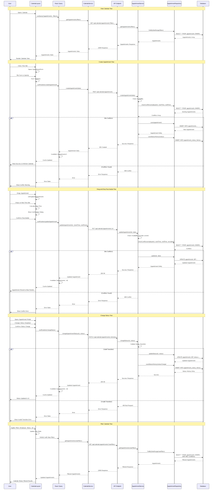

# Calendar and Appointment Viewing - Architecture and Design

**Document Version:** 1.2  
**Date:** 2025-12-26  
**Status:** Draft  
**Last Updated:** 2025-01-24  
**Related Tasks:** TASK-FEAT-025  
**Related Documents:** 
- [Calendar and Appointment Viewing Requirements](./CALENDAR_APPOINTMENT_REQUIREMENTS.md)
- [Dashboard Requirements](../../DASHBOARD_REQUIREMENTS.md#calendar-and-appointment-viewing)

## Table of Contents

1. [Overview](#overview)
2. [System Architecture](#system-architecture)
3. [Database Schema Design](#database-schema-design)
4. [API Design](#api-design)
5. [Frontend Component Architecture](#frontend-component-architecture)
6. [State Management Design](#state-management-design)
7. [Integration Architecture](#integration-architecture)
8. [Data Flow Diagrams](#data-flow-diagrams)
9. [Sequence Diagrams](#sequence-diagrams)
10. [Design Decisions](#design-decisions)

---

## Overview

### Purpose

This document defines the complete architecture and design for the Calendar and Appointment Viewing system within the Dashboard Management System. The architecture follows Domain-Driven Design (DDD) principles and provides a scalable, maintainable solution for calendar functionality.

### Architecture Principles

- **Domain-Driven Design (DDD)**: Clear separation of domain, application, infrastructure, and presentation layers
- **RESTful API**: Standard REST endpoints for calendar and appointment operations
- **Component-Based Frontend**: Reusable React components with clear responsibilities
- **Single Source of Truth**: Shared database between booking system and calendar dashboard
- **Real-Time Updates**: Polling mechanism for appointment updates (WebSocket support for future)
- **Performance**: Optimized queries, caching, and efficient rendering

### Technology Stack

- **Backend**: Node.js, Express.js, TypeORM, PostgreSQL
- **Frontend**: React 19+, TypeScript, React Query, React Hook Form
- **Database**: PostgreSQL with TypeORM entities
- **Validation**: Zod or class-validator
- **Date Handling**: date-fns
- **Export**: pdfkit (PDF), csv-writer (CSV)

---

## System Architecture

### High-Level Architecture

The Calendar and Appointment Viewing system consists of four main layers:

1. **Presentation Layer**: React components for calendar UI
2. **Application Layer**: API endpoints and business logic
3. **Domain Layer**: Business entities and domain logic
4. **Infrastructure Layer**: Database access and external integrations

### System Components

[](../../diagrams/calendar-system-architecture.mmd)

*Figure 1: Calendar and Appointment Viewing System Architecture*  
*Source: [calendar-system-architecture.mmd](../../diagrams/calendar-system-architecture.mmd)*

The diagram above illustrates the four-layer architecture:
- **Presentation Layer**: React components for calendar UI (CalendarView, Appointment components, Filters)
- **Application Layer**: API controllers and services (Calendar, Appointment, Export services)
- **Domain Layer**: Business entities and domain services (Appointment Entity, TimeSlot, Status, Conflict/Availability services)
- **Infrastructure Layer**: Data access and external integrations (Repositories, Database, Booking Sync)

See [System Architecture Diagram](#system-architecture-diagram) section for detailed component descriptions.

---

## Database Schema Design

### Entity Relationship Overview

The calendar system extends the existing appointment schema with additional entities for status tracking and audit logging.

### Database Schema UML Diagram

[](../../diagrams/calendar-erd.mmd)

*Figure 1: Calendar and Appointment Viewing Database Schema (ERD)*  
*Source: [calendar-erd.mmd](../../diagrams/calendar-erd.mmd)*

The Entity Relationship Diagram above illustrates the database schema for the calendar system, showing the relationships between appointments, services, employees, users, and audit history tables.

### Core Entities

#### Appointment Entity

**Table:** `appointments`

**Fields:**
- `id` (UUID, Primary Key)
- `customer_id` (UUID, Foreign Key → users/customers)
- `employee_id` (UUID, Foreign Key → employees)
- `service_id` (UUID, Foreign Key → services) - Main service
- `start_time` (TIMESTAMP, NOT NULL)
- `end_time` (TIMESTAMP, NOT NULL)
- `status` (ENUM: SCHEDULED, COMPLETED, CANCELLED, NO_SHOW, NOT NULL)
- `notes` (TEXT, nullable)
- `source` (ENUM: BOOKING_SYSTEM, MANUAL, NOT NULL) - Indicates how appointment was created
- `created_at` (TIMESTAMP, NOT NULL)
- `updated_at` (TIMESTAMP, NOT NULL)
- `created_by` (UUID, Foreign Key → users, nullable) - User who created appointment
- `cancellation_reason` (TEXT, nullable) - Reason if cancelled

**Relationships:**
- Many-to-One: `appointments.customer_id` → `users.id` (or `customers.id`)
- Many-to-One: `appointments.employee_id` → `employees.id`
- Many-to-One: `appointments.service_id` → `services.id`
- Many-to-One: `appointments.created_by` → `users.id`

**Indexes:**
- Primary: `id`
- Index: `(employee_id, start_time, end_time)` - For availability queries
- Index: `(customer_id, start_time)` - For customer appointment queries
- Index: `(status, start_time)` - For status filtering
- Index: `start_time` - For date range queries
- Index: `(employee_id, start_time)` - For employee calendar queries

**Constraints:**
- `end_time > start_time` (check constraint)
- `start_time >= created_at` (check constraint, allows future appointments)

#### Appointment Service Junction Table

**Table:** `appointment_services`

**Purpose:** Many-to-many relationship for appointments with multiple services (main service + add-ons)

**Fields:**
- `id` (UUID, Primary Key)
- `appointment_id` (UUID, Foreign Key → appointments, CASCADE DELETE)
- `service_id` (UUID, Foreign Key → services)
- `is_main_service` (BOOLEAN, NOT NULL) - True for main service, false for add-ons
- `created_at` (TIMESTAMP, NOT NULL)

**Indexes:**
- Primary: `id`
- Index: `appointment_id`
- Index: `service_id`
- Unique: `(appointment_id, service_id)` - Prevent duplicate service assignments

#### Appointment Status History Entity (Audit Log)

**Table:** `appointment_status_history`

**Purpose:** Track all status changes for audit and history purposes

**Fields:**
- `id` (UUID, Primary Key)
- `appointment_id` (UUID, Foreign Key → appointments, CASCADE DELETE)
- `previous_status` (ENUM, nullable) - Previous status (null for initial creation)
- `new_status` (ENUM, NOT NULL) - New status
- `changed_by` (UUID, Foreign Key → users, nullable) - User who made the change
- `change_reason` (TEXT, nullable) - Optional reason for status change
- `created_at` (TIMESTAMP, NOT NULL)

**Indexes:**
- Primary: `id`
- Index: `appointment_id` - For querying appointment history
- Index: `created_at` - For audit queries
- Index: `changed_by` - For user activity tracking

**Relationships:**
- Many-to-One: `appointment_status_history.appointment_id` → `appointments.id` (CASCADE DELETE)
- Many-to-One: `appointment_status_history.changed_by` → `users.id`

### Entity Relationship Summary

The diagram above shows the complete database schema. Key relationships include:
- **Appointments** are linked to **Users** (customers), **Employees**, and **Services**
- **Appointment Services** junction table supports multiple services per appointment (main + add-ons)
- **Appointment Status History** tracks all status changes for audit purposes
- All entities include proper foreign key constraints and indexes for performance

See [Database ERD Diagram](#database-erd-diagram) in the Diagrams section for the full visual representation.

### Database Migrations

**Migration 1: Create Appointment Extensions**
- Add `source` field to appointments table
- Add `created_by` field to appointments table
- Add `cancellation_reason` field to appointments table
- Add indexes for calendar queries

**Migration 2: Create Appointment Services Junction Table**
- Create `appointment_services` table
- Add foreign keys and indexes

**Migration 3: Create Appointment Status History Table**
- Create `appointment_status_history` table
- Add foreign keys and indexes

---

## API Design

### API Base Path

All calendar and appointment endpoints are prefixed with `/api/calendar`

### Authentication and Authorization

All endpoints require authentication via JWT token in Authorization header:
```
Authorization: Bearer <token>
```

**Authorization by Role:**
- **OWNER, MANAGER, ADMIN**: Full access to all endpoints
- **EMPLOYEE**: Read-only access to calendar, limited to own appointments
- **RECEPTIONIST**: Full calendar access, can create/edit appointments, change status

### Calendar Endpoints

#### GET /api/calendar/appointments

**Purpose:** List appointments with filtering and pagination

**Query Parameters:**
- `startDate` (ISO 8601 date, optional): Start of date range filter
- `endDate` (ISO 8601 date, optional): End of date range filter
- `employeeId` (UUID, optional): Filter by employee ID
- `employeeIds` (UUID[], optional): Filter by multiple employee IDs (comma-separated)
- `status` (ENUM, optional): Filter by status (SCHEDULED, COMPLETED, CANCELLED, NO_SHOW)
- `statuses` (ENUM[], optional): Filter by multiple statuses (comma-separated)
- `customerId` (UUID, optional): Filter by customer ID
- `serviceId` (UUID, optional): Filter by service ID
- `serviceIdCode` (string, optional): Filter by service ID code (e.g., "M1", "P5", "E3") - supports partial matching (e.g., "M" for all Manicure services)
- `dayOfWeek` (number[], optional): Filter by day of week (0=Sunday, 1=Monday, etc.) - comma-separated
- `hourOfDay` (number, optional): Filter by hour of day (0-23)
- `hourRangeStart` (number, optional): Start hour for time range filter (0-23)
- `hourRangeEnd` (number, optional): End hour for time range filter (0-23)
- `search` (string, optional): Search by customer name or appointment ID
- `page` (number, optional, default: 1): Page number for pagination
- `limit` (number, optional, default: 50): Items per page
- `sortBy` (string, optional, default: "startTime"): Sort field (startTime, endTime, createdAt)
- `sortOrder` (string, optional, default: "ASC"): Sort order (ASC, DESC)

**Response:**
```json
{
  "appointments": [
    {
      "id": "uuid",
      "customerId": "uuid",
      "customer": {
        "id": "uuid",
        "name": "John Doe",
        "email": "john@example.com",
        "phone": "+1234567890"
      },
      "employeeId": "uuid",
      "employee": {
        "id": "uuid",
        "name": "Jane Smith",
        "color": "#FF5733"
      },
      "serviceId": "uuid",
      "services": [
        {
          "id": "uuid",
          "name": "Manicure",
          "isMainService": true
        },
        {
          "id": "uuid",
          "name": "Nail Art",
          "isMainService": false
        }
      ],
      "startTime": "2025-01-15T10:00:00Z",
      "endTime": "2025-01-15T11:00:00Z",
      "status": "SCHEDULED",
      "notes": "Customer prefers natural colors",
      "source": "BOOKING_SYSTEM",
      "createdAt": "2025-01-10T08:00:00Z",
      "updatedAt": "2025-01-10T08:00:00Z"
    }
  ],
  "pagination": {
    "page": 1,
    "limit": 50,
    "total": 150,
    "totalPages": 3
  },
  "filters": {
    "startDate": "2025-01-15",
    "endDate": "2025-01-20",
    "employeeId": "uuid"
  }
}
```

**Status Codes:**
- `200 OK`: Success
- `400 Bad Request`: Invalid query parameters
- `401 Unauthorized`: Missing or invalid token
- `403 Forbidden`: Insufficient permissions

#### GET /api/calendar/appointments/:id

**Purpose:** Get single appointment with full details

**Path Parameters:**
- `id` (UUID): Appointment ID

**Response:**
```json
{
  "appointment": {
    "id": "uuid",
    "customerId": "uuid",
    "customer": { /* full customer object */ },
    "employeeId": "uuid",
    "employee": { /* full employee object */ },
    "serviceId": "uuid",
    "services": [ /* array of services */ ],
    "startTime": "2025-01-15T10:00:00Z",
    "endTime": "2025-01-15T11:00:00Z",
    "status": "SCHEDULED",
    "notes": "Customer prefers natural colors",
    "source": "BOOKING_SYSTEM",
    "statusHistory": [
      {
        "id": "uuid",
        "previousStatus": null,
        "newStatus": "SCHEDULED",
        "changedBy": "uuid",
        "changeReason": null,
        "createdAt": "2025-01-10T08:00:00Z"
      }
    ],
    "createdAt": "2025-01-10T08:00:00Z",
    "updatedAt": "2025-01-10T08:00:00Z",
    "createdBy": "uuid"
  }
}
```

**Status Codes:**
- `200 OK`: Success
- `404 Not Found`: Appointment not found
- `401 Unauthorized`: Missing or invalid token
- `403 Forbidden`: Insufficient permissions

#### GET /api/calendar/availability

**Purpose:** Check employee availability for a time slot

**Query Parameters:**
- `employeeId` (UUID, required): Employee ID
- `date` (ISO 8601 date, required): Date to check
- `startTime` (ISO 8601 datetime, optional): Start time to check
- `endTime` (ISO 8601 datetime, optional): End time to check
- `duration` (number, optional): Duration in minutes (if startTime provided)
- `excludeAppointmentId` (UUID, optional): Exclude this appointment from conflict check (for updates)

**Response:**
```json
{
  "available": true,
  "conflicts": [],
  "availableTimeSlots": [
    {
      "startTime": "2025-01-15T09:00:00Z",
      "endTime": "2025-01-15T09:15:00Z"
    },
    {
      "startTime": "2025-01-15T09:15:00Z",
      "endTime": "2025-01-15T09:30:00Z"
    }
  ]
}
```

**Status Codes:**
- `200 OK`: Success
- `400 Bad Request`: Missing required parameters
- `401 Unauthorized`: Missing or invalid token

### Appointment Management Endpoints

#### POST /api/calendar/appointments

**Purpose:** Create new appointment

**Request Body:**
```json
{
  "customerId": "uuid",
  "employeeId": "uuid",
  "serviceId": "uuid",
  "addonServiceIds": ["uuid1", "uuid2"],
  "startTime": "2025-01-15T10:00:00Z",
  "endTime": "2025-01-15T11:00:00Z",
  "notes": "Customer prefers natural colors",
  "source": "MANUAL",
  "notifyCustomer": false
}
```

**Response:**
```json
{
  "appointment": { /* full appointment object */ },
  "conflicts": []
}
```

**Status Codes:**
- `201 Created`: Appointment created successfully
- `400 Bad Request`: Validation errors or conflicts
- `401 Unauthorized`: Missing or invalid token
- `403 Forbidden`: Insufficient permissions
- `409 Conflict`: Appointment conflicts with existing appointment

#### PUT /api/calendar/appointments/:id

**Purpose:** Update appointment details

**Path Parameters:**
- `id` (UUID): Appointment ID

**Request Body:**
```json
{
  "customerId": "uuid",
  "employeeId": "uuid",
  "serviceId": "uuid",
  "addonServiceIds": ["uuid1", "uuid2"],
  "startTime": "2025-01-15T10:00:00Z",
  "endTime": "2025-01-15T11:00:00Z",
  "notes": "Updated notes",
  "notifyCustomer": false
}
```

**Response:**
```json
{
  "appointment": { /* updated appointment object */ },
  "conflicts": []
}
```

**Status Codes:**
- `200 OK`: Appointment updated successfully
- `400 Bad Request`: Validation errors or conflicts
- `401 Unauthorized`: Missing or invalid token
- `403 Forbidden`: Insufficient permissions
- `404 Not Found`: Appointment not found
- `409 Conflict`: Appointment conflicts with existing appointment

#### PATCH /api/calendar/appointments/:id/status

**Purpose:** Update appointment status

**Path Parameters:**
- `id` (UUID): Appointment ID

**Request Body:**
```json
{
  "status": "COMPLETED",
  "reason": "Appointment completed successfully",
  "notifyCustomer": false
}
```

**Response:**
```json
{
  "appointment": { /* updated appointment object */ },
  "statusHistory": [ /* updated status history */ ]
}
```

**Status Codes:**
- `200 OK`: Status updated successfully
- `400 Bad Request`: Invalid status transition
- `401 Unauthorized`: Missing or invalid token
- `403 Forbidden`: Insufficient permissions
- `404 Not Found`: Appointment not found

#### PATCH /api/calendar/appointments/bulk-status

**Purpose:** Update status for multiple appointments (bulk update)

**Request Body:**
```json
{
  "appointmentIds": ["uuid1", "uuid2", "uuid3"],
  "status": "COMPLETED",
  "reason": "Bulk status update",
  "notifyCustomer": false
}
```

**Response:**
```json
{
  "updated": 3,
  "appointments": [ /* array of updated appointment objects */ ],
  "statusHistory": [ /* array of status history entries for all updates */ ]
}
```

**Status Codes:**
- `200 OK`: Status updated successfully for all appointments
- `400 Bad Request`: Invalid status transition or empty appointmentIds
- `401 Unauthorized`: Missing or invalid token
- `403 Forbidden`: Insufficient permissions
- `207 Multi-Status`: Partial success (some appointments failed) - includes `errors` array

#### DELETE /api/calendar/appointments/:id

**Purpose:** Delete appointment (soft delete or hard delete)

**Path Parameters:**
- `id` (UUID): Appointment ID

**Query Parameters:**
- `hardDelete` (boolean, optional, default: false): If true, permanently delete; if false, soft delete (set status to CANCELLED)

**Request Body (optional):**
```json
{
  "cancellationReason": "Customer requested cancellation"
}
```

**Response:**
```json
{
  "success": true,
  "message": "Appointment deleted successfully"
}
```

**Status Codes:**
- `200 OK`: Appointment deleted successfully
- `401 Unauthorized`: Missing or invalid token
- `403 Forbidden`: Insufficient permissions
- `404 Not Found`: Appointment not found

### Export Endpoints

#### GET /api/calendar/export/pdf

**Purpose:** Export calendar to PDF

**Query Parameters:**
- `startDate` (ISO 8601 date, required): Start date
- `endDate` (ISO 8601 date, required): End date
- `employeeId` (UUID, optional): Filter by employee
- `viewType` (string, optional, default: "week"): View type (day, week, month)

**Response:**
- Content-Type: `application/pdf`
- File download with PDF content

**Status Codes:**
- `200 OK`: PDF generated successfully
- `400 Bad Request`: Invalid parameters
- `401 Unauthorized`: Missing or invalid token
- `403 Forbidden`: Insufficient permissions

#### GET /api/calendar/export/csv

**Purpose:** Export appointments to CSV

**Query Parameters:**
- `startDate` (ISO 8601 date, required): Start date
- `endDate` (ISO 8601 date, required): End date
- `employeeId` (UUID, optional): Filter by employee
- `status` (ENUM, optional): Filter by status
- `includeFields` (string[], optional): Fields to include (comma-separated)

**Response:**
- Content-Type: `text/csv`
- File download with CSV content

**Status Codes:**
- `200 OK`: CSV generated successfully
- `400 Bad Request`: Invalid parameters
- `401 Unauthorized`: Missing or invalid token
- `403 Forbidden`: Insufficient permissions

**Note:** Print functionality is client-side only (browser print dialog). No API endpoint required. See Frontend Component Architecture section for print implementation details.

### Error Response Format

All error responses follow this format:

```json
{
  "error": {
    "code": "ERROR_CODE",
    "message": "Human-readable error message",
    "details": {
      "field": "Additional error details"
    }
  }
}
```

**Common Error Codes:**
- `VALIDATION_ERROR`: Request validation failed
- `NOT_FOUND`: Resource not found
- `UNAUTHORIZED`: Authentication required
- `FORBIDDEN`: Insufficient permissions
- `CONFLICT`: Appointment conflict detected
- `INVALID_STATUS_TRANSITION`: Invalid status change
- `INTERNAL_ERROR`: Server error

---

## Frontend Component Architecture

### Component Hierarchy

[](../../diagrams/calendar-component-hierarchy.mmd)

*Figure 3: Calendar Component Hierarchy*  
*Source: [calendar-component-hierarchy.mmd](../../diagrams/calendar-component-hierarchy.mmd)*

The diagram above shows the complete React component hierarchy for the calendar system, including the main CalendarLayout container, view components (Day, Week, Month), filters, and modal components.

### Component Descriptions

#### CalendarLayout

**Purpose:** Main container component for calendar interface

**Props:**
```typescript
interface CalendarLayoutProps {
  userRole: UserRole;
  initialView?: 'day' | 'week' | 'month';
  initialDate?: Date;
}
```

**State:**
- Current view type (day/week/month)
- Selected date
- Active filters
- Loading state
- Error state

**Responsibilities:**
- Manage calendar view state
- Coordinate between header, filters, and view components
- Handle data fetching via React Query
- Manage appointment modal state
- Handle keyboard shortcuts (T: Today, D/W/M: View switch, Esc: Close modals)
- Manage filter persistence (URL parameters or localStorage)

#### CalendarViewSwitcher

**Purpose:** Switch between day, week, and month views

**Props:**
```typescript
interface CalendarViewSwitcherProps {
  currentView: 'day' | 'week' | 'month';
  onViewChange: (view: 'day' | 'week' | 'month') => void;
}
```

**Keyboard Shortcuts:**
- `D`: Switch to day view
- `W`: Switch to week view
- `M`: Switch to month view
- `T`: Jump to today
- `Left/Right Arrow`: Previous/Next period
- `Esc`: Close modals

#### DayView

**Purpose:** Display appointments in day view with hourly time slots

**Props:**
```typescript
interface DayViewProps {
  date: Date;
  appointments: Appointment[];
  employees: Employee[];
  selectedEmployeeIds: string[];
  onTimeSlotClick: (timeSlot: TimeSlot) => void;
  onAppointmentClick: (appointment: Appointment) => void;
  onAppointmentDrag: (appointment: Appointment, newTime: Date) => void;
  businessHours: { start: number; end: number };
  timeSlotDuration: number; // minutes, default 15
}
```

**Features:**
- Hourly time slots (default 15-minute increments)
- Appointment cards positioned by time
- Drag-and-drop rescheduling
- Current time indicator
- Employee columns (if multiple employees selected)

#### WeekView

**Purpose:** Display appointments in week view with daily columns

**Props:**
```typescript
interface WeekViewProps {
  startDate: Date; // Start of week
  appointments: Appointment[];
  employees: Employee[];
  selectedEmployeeIds: string[];
  onTimeSlotClick: (timeSlot: TimeSlot, day: Date) => void;
  onAppointmentClick: (appointment: Appointment) => void;
  onAppointmentDrag: (appointment: Appointment, newDate: Date, newTime: Date) => void;
  businessHours: { start: number; end: number };
  timeSlotDuration: number;
}
```

**Features:**
- Daily columns (Sunday-Saturday or Monday-Sunday)
- Appointment cards positioned by day and time
- Drag-and-drop between days
- Employee columns (if multiple employees selected)
- Current day highlighted

#### MonthView

**Purpose:** Display appointments in month view with calendar grid

**Props:**
```typescript
interface MonthViewProps {
  month: Date; // First day of month
  appointments: Appointment[];
  onDayClick: (date: Date) => void;
  onAppointmentIndicatorClick: (date: Date) => void;
}
```

**Features:**
- Calendar grid (weeks × days)
- Appointment indicators as dots
- Visual density indicators (no/low/high booking)
- Click day to switch to day view (MUST HAVE)
- Current date highlighted
- Appointment count per day display

#### AppointmentCard

**Purpose:** Display appointment information in calendar

**Props:**
```typescript
interface AppointmentCardProps {
  appointment: Appointment;
  onClick: () => void;
  onDragStart: (appointment: Appointment) => void;
  color?: string; // Employee or status color
  showEmployee?: boolean;
}
```

**Features:**
- Customer name
- Service name
- Time display
- Status indicator
- Appointment source indicator (icon: "Booked online" vs "Manual")
- Hover tooltip with full details
- Drag handle for rescheduling
- Double-click: Open edit form directly (optional)
- Right-click: Context menu with quick actions (optional)

#### AppointmentModal

**Purpose:** Display and manage appointment details

**Props:**
```typescript
interface AppointmentModalProps {
  appointment: Appointment;
  isOpen: boolean;
  onClose: () => void;
  onEdit: () => void;
  onStatusChange: (status: AppointmentStatus) => void;
  onCancel: () => void;
  onDelete: () => void;
  userRole: UserRole;
}
```

#### AppointmentForm

**Purpose:** Create or edit appointment

**Props:**
```typescript
interface AppointmentFormProps {
  appointment?: Appointment; // If provided, edit mode
  isOpen: boolean;
  onClose: () => void;
  onSubmit: (appointment: CreateAppointmentRequest) => Promise<void>;
  initialDate?: Date;
  initialTime?: Date;
  initialEmployeeId?: string;
}
```

**Features:**
- Customer search/select with autocomplete
- Option to create new customer (if user has permission)
- Employee selector
- **Service Selection (Polished, Fashionable Design - MUST HAVE):**
  - Modern, professional service dropdown interface
  - Clean, organized service list with clear visual hierarchy
  - Visually appealing service items/cards
  - Smooth animations and transitions
  - Professional typography and spacing
  - Service ID displayed in format: "M1 - Classic Manicure" or "M1: Classic Manicure"
  - **Service ID Quick Filter Support:**
    - Type service ID code (e.g., "M1", "P5") to filter to specific service
    - Type single letter (e.g., "M") to filter to all services in category
    - Real-time filtering as user types
    - Case-insensitive matching
  - **Service Selection Methods:**
    - Type number (e.g., "1" for M1, "5" for P5) to select service
    - Click service name/item in dropdown to add to appointment
    - Visual feedback on selection (highlight, checkmark, animation)
  - Service multi-select (main + add-ons)
  - Shows service duration and price
  - Service category/type indicator
- Date/time picker
- Conflict detection
- Form validation
- "Save" button (creates/updates appointment)
- "Save and Notify Customer" button (creates/updates and sends notification)
- Notification checkbox for customer notifications

#### CalendarFilters

**Purpose:** Filter appointments by various criteria

**Props:**
```typescript
interface CalendarFiltersProps {
  filters: CalendarFilters;
  onFiltersChange: (filters: CalendarFilters) => void;
  employees: Employee[];
  services: Service[];
  userRole: UserRole; // For receptionist-specific filters
  onPresetSelect?: (preset: FilterPreset) => void; // Quick filter presets
}
```

**Filter Presets:**
- "Monday Mornings" (Monday, 9 AM - 12 PM)
- "Friday Afternoons" (Friday, 2 PM - 5 PM)
- Custom presets (future enhancement)

**Filter Types:**
- Employee (multi-select)
- Status (multi-select checkboxes)
- **Service Filter with Service ID Quick Filter (MUST HAVE):**
  - Multi-select service dropdown
  - **Service ID Quick Filter:**
    - Type service ID code format (e.g., "M1", "P5", "E3") to filter
    - Single letter (e.g., "M") filters all services in that category
    - Letter + number (e.g., "M1") filters specific service
    - Real-time filtering as user types
    - Case-insensitive matching
    - Service IDs displayed in dropdown: "M1 - Classic Manicure" or "M1: Classic Manicure"
  - Polished, fashionable dropdown design (see AppointmentForm for details)
  - Service selection by typing number or clicking service name
- Date range
- Day of week (receptionist - multi-select)
- Hour of day (receptionist - time range)
- Customer search
- **Search by Service ID Code:**
  - Search field accepts service ID format
  - Supports partial matching (single letter or letter+number)
  - Real-time search results
- Quick filter presets (e.g., "Monday Mornings", "Friday Afternoons")
- Filter persistence (URL parameters or localStorage)

---

## State Management Design

### State Management Strategy

The calendar system uses a hybrid approach combining multiple state management techniques:

1. **Local Component State (useState)**: UI state (modals, view type, selected date)
2. **Context API**: Calendar configuration (business hours, time slots, user preferences)
3. **React Query**: Server state (appointments, employees, services)
4. **React Hook Form**: Form state (appointment creation/editing)

### State Layers

#### 1. UI State (Local Component State)

**Purpose:** Manage UI interactions and temporary state

**Examples:**
- Modal open/close state
- View type (day/week/month)
- Selected date
- Active filters (local copy before applying)
- Loading indicators
- Error messages

**Location:** Individual components using `useState`

#### 2. Calendar Configuration (Context API)

**Purpose:** Share calendar configuration across components

**Context:** `CalendarConfigContext`

**Configuration:**
```typescript
interface CalendarConfig {
  businessHours: {
    start: number; // Hour (0-23)
    end: number; // Hour (0-23)
  };
  timeSlotDuration: number; // Minutes (15 or 30)
  weekStartDay: 'sunday' | 'monday';
  employeeColors: Record<string, string>; // Employee ID -> color
  statusColors: Record<AppointmentStatus, string>;
}
```

**Usage:**
- Business hours for time slot generation
- Time slot duration for calendar rendering
- Employee colors for appointment display
- Status colors for appointment display

#### 3. Server State (React Query)

**Purpose:** Manage data fetching, caching, and synchronization

**Queries:**
```typescript
// Appointments query
useQuery({
  queryKey: ['appointments', filters, dateRange],
  queryFn: () => calendarService.getAppointments(filters),
  staleTime: 30000, // 30 seconds
  refetchInterval: 30000, // Poll every 30 seconds
});

// Single appointment query
useQuery({
  queryKey: ['appointment', appointmentId],
  queryFn: () => calendarService.getAppointment(appointmentId),
});

// Availability query
useQuery({
  queryKey: ['availability', employeeId, date],
  queryFn: () => calendarService.checkAvailability(employeeId, date),
});
```

**Mutations:**
```typescript
// Create appointment
useMutation({
  mutationFn: (data: CreateAppointmentRequest) => 
    calendarService.createAppointment(data),
  onSuccess: () => {
    queryClient.invalidateQueries(['appointments']);
  },
});

// Update appointment
useMutation({
  mutationFn: ({ id, data }: { id: string; data: UpdateAppointmentRequest }) =>
    calendarService.updateAppointment(id, data),
  onSuccess: () => {
    queryClient.invalidateQueries(['appointments']);
    queryClient.invalidateQueries(['appointment', id]);
  },
});

// Change status
useMutation({
  mutationFn: ({ id, status }: { id: string; status: AppointmentStatus }) =>
    calendarService.changeAppointmentStatus(id, status),
  onSuccess: () => {
    queryClient.invalidateQueries(['appointments']);
  },
});
```

**Caching Strategy:**
- Cache appointments by date range and filters
- Invalidate cache on mutations
- Poll for updates every 30 seconds
- Optimistic updates for better UX
- Filter state persisted in URL parameters or localStorage
- Filter state restored on page load

#### 4. Form State (React Hook Form)

**Purpose:** Manage appointment creation/editing forms

**Form Schema (Zod):**
```typescript
const appointmentFormSchema = z.object({
  customerId: z.string().uuid(),
  employeeId: z.string().uuid(),
  serviceId: z.string().uuid(),
  addonServiceIds: z.array(z.string().uuid()).optional(),
  startTime: z.string().datetime(),
  endTime: z.string().datetime(),
  notes: z.string().optional(),
});
```

**Usage:**
- Form validation
- Error handling
- Field-level validation
- Conflict detection integration

### Custom Hooks

#### useCalendar

**Purpose:** Main hook for calendar data and operations

```typescript
function useCalendar(filters: CalendarFilters, dateRange: DateRange) {
  const appointmentsQuery = useQuery({
    queryKey: ['appointments', filters, dateRange],
    queryFn: () => calendarService.getAppointments(filters, dateRange),
  });

  const createAppointmentMutation = useMutation({
    mutationFn: calendarService.createAppointment,
    onSuccess: () => appointmentsQuery.refetch(),
  });

  return {
    appointments: appointmentsQuery.data,
    isLoading: appointmentsQuery.isLoading,
    error: appointmentsQuery.error,
    createAppointment: createAppointmentMutation.mutate,
    refetch: appointmentsQuery.refetch,
  };
}
```

#### useAppointments

**Purpose:** Hook for appointment CRUD operations

```typescript
function useAppointments() {
  const queryClient = useQueryClient();

  const createMutation = useMutation({
    mutationFn: calendarService.createAppointment,
    onSuccess: () => {
      queryClient.invalidateQueries(['appointments']);
    },
  });

  const updateMutation = useMutation({
    mutationFn: ({ id, data }) => calendarService.updateAppointment(id, data),
    onSuccess: (_, { id }) => {
      queryClient.invalidateQueries(['appointments']);
      queryClient.invalidateQueries(['appointment', id]);
    },
  });

  const deleteMutation = useMutation({
    mutationFn: calendarService.deleteAppointment,
    onSuccess: () => {
      queryClient.invalidateQueries(['appointments']);
    },
  });

  return {
    create: createMutation.mutate,
    update: updateMutation.mutate,
    delete: deleteMutation.mutate,
    isCreating: createMutation.isLoading,
    isUpdating: updateMutation.isLoading,
    isDeleting: deleteMutation.isLoading,
  };
}
```

#### useAvailability

**Purpose:** Hook for checking employee availability

```typescript
function useAvailability(employeeId: string, date: Date, duration: number) {
  return useQuery({
    queryKey: ['availability', employeeId, date, duration],
    queryFn: () => calendarService.checkAvailability(employeeId, date, duration),
    enabled: !!employeeId && !!date,
  });
}
```

#### useCalendarFilters

**Purpose:** Hook for managing filter state

```typescript
function useCalendarFilters() {
  const [filters, setFilters] = useState<CalendarFilters>({
    employeeIds: [],
    statuses: [],
    serviceIds: [],
    dateRange: null,
    dayOfWeek: [],
    hourRange: null,
    customerSearch: '',
  });

  const updateFilter = (key: keyof CalendarFilters, value: any) => {
    setFilters(prev => ({ ...prev, [key]: value }));
  };

  const clearFilters = () => {
    setFilters({
      employeeIds: [],
      statuses: [],
      serviceIds: [],
      dateRange: null,
      dayOfWeek: [],
      hourRange: null,
      customerSearch: '',
    });
  };

  return {
    filters,
    updateFilter,
    clearFilters,
    hasActiveFilters: Object.values(filters).some(v => 
      Array.isArray(v) ? v.length > 0 : v !== null && v !== ''
    ),
  };
}
```

---

## Integration Architecture

### Integration with Booking System

**Architecture:** Shared Database

The calendar system and booking system share the same database, eliminating the need for data synchronization.

**Data Flow:**
```
Customer Booking Flow
  ↓
Booking System (Frontend)
  ↓
POST /api/bookings/appointments
  ↓
Appointment Service
  ↓
Database (appointments table)
  ↓
Calendar Dashboard (reads from same table)
```

**Conflict Resolution:**
- Both systems check for conflicts before creating appointments
- Calendar system displays conflicts if they occur
- Manual resolution required for conflicts

**Real-Time Updates:**
- Calendar polls database every 30 seconds for new appointments
- Future: WebSocket support for real-time push updates

### Integration with Employee Management

**Data Flow:**
```
Employee Management System
  ↓
Employee Data (employees table)
  ↓
Calendar System
  ├── Employee Filter Dropdown
  ├── Employee Color Coding
  └── Employee Availability Display
```

**Employee Data Used:**
- Employee list for filtering
- Employee colors for calendar display
- Employee availability (based on appointments)

**API Integration:**
- Calendar uses existing employee endpoints
- Employee data cached via React Query

### Integration with Metrics

**Data Flow:**
```
Calendar System
  ↓
Appointment CRUD Operations
  ↓
Database (appointments table)
  ↓
Metrics Service (queries same table)
  ├── Appointment Counts
  ├── Revenue Calculations
  └── Performance Metrics
```

**Data Sharing:**
- Metrics service queries appointment data directly
- No direct API calls between systems
- Real-time updates: Metrics refresh when appointments change

**Metrics Calculated:**
- Total appointments
- Appointments by status
- Appointments by service
- Appointments by employee
- Revenue (if pricing available)

---

## Data Flow Diagrams

[](../../diagrams/calendar-data-flow.mmd)

*Figure 2: Calendar and Appointment Viewing Data Flow*  
*Source: [calendar-data-flow.mmd](../../diagrams/calendar-data-flow.mmd)*

The diagram above illustrates the overall data flow through the system layers, showing how user actions flow from the frontend through the API layer, application layer, domain layer, and infrastructure layer to the database, and how responses flow back.

### Key Data Flows

**Create Appointment Flow:**
1. User action → Frontend components → React Query
2. API request → Authentication/Authorization → Validation
3. Application service → Domain logic → Repository
4. Database insert → Response → Cache update → UI refresh

**View Calendar Flow:**
1. Component mount → React Query → API request
2. Calendar service → Repository → Database query
3. Response → Cache → Component render

**Update Appointment Flow:**
1. User action → Form validation → API request
2. Conflict detection → Domain validation → Repository update
3. Database update → Response → Cache invalidation → UI update

---

## Sequence Diagrams

[](../../diagrams/calendar-sequence-diagrams.mmd)

*Figure 4: Calendar System Sequence Diagrams*  
*Source: [calendar-sequence-diagrams.mmd](../../diagrams/calendar-sequence-diagrams.mmd)*

The sequence diagrams above illustrate detailed step-by-step workflows for key operations:
- **Create Appointment**: Complete flow from user action to database persistence
- **View Calendar**: Data fetching and rendering workflow
- **Drag-and-Drop Reschedule**: Appointment rescheduling with conflict detection
- **Status Update**: Status change workflow with audit logging

---

## Design Decisions

### 1. Shared Database Architecture

**Decision:** Calendar and booking system share the same database

**Rationale:**
- Eliminates data synchronization complexity
- Single source of truth
- Real-time consistency
- Simpler architecture

**Trade-offs:**
- Tight coupling between systems
- Database becomes shared dependency
- Requires careful conflict resolution

### 2. Polling vs WebSocket for Real-Time Updates

**Decision:** Use polling (30-second interval) initially, plan for WebSocket support

**Rationale:**
- Simpler implementation
- Works with existing infrastructure
- Sufficient for current use case
- Can upgrade to WebSocket later

**Trade-offs:**
- Slight delay in updates (up to 30 seconds)
- More server load than WebSocket
- Less efficient than push notifications

### 3. 15-Minute Default Time Slots

**Decision:** Default to 15-minute time slot increments

**Rationale:**
- More granular scheduling
- Better for short services
- Aligns with requirements (MUST HAVE)
- Configurable for future flexibility

**Trade-offs:**
- More time slots to render
- Slightly more complex UI
- Better user experience

### 4. Drag-and-Drop Rescheduling

**Decision:** Implement drag-and-drop for appointment rescheduling

**Rationale:**
- Required feature (MUST HAVE)
- Better user experience
- Intuitive interaction
- Industry standard

**Trade-offs:**
- More complex implementation
- Requires conflict detection during drag
- Need visual feedback

### 5. Month View with Dots (Not Bars)

**Decision:** Use dots for appointment indicators in month view

**Rationale:**
- Required feature (MUST HAVE)
- Cleaner visual design
- Better for density visualization
- Less cluttered than bars

**Trade-offs:**
- Less detail than bars
- Requires click to see details
- Better for overview, less for details

### 6. Receptionist-Specific Filters

**Decision:** Implement day of week and hour of day filters for receptionist role

**Rationale:**
- Required feature (MUST HAVE)
- Supports receptionist workflow
- Enables pattern identification
- Can be combined with other filters

**Trade-offs:**
- Additional filter complexity
- More query parameters
- Database query optimization needed

### 7. Employee Columns in Calendar

**Decision:** Display each employee's schedule as a column in day/week view

**Rationale:**
- Required feature (MUST HAVE)
- Clear visual separation
- Supports drag-and-drop between employees
- Better for multi-employee management

**Trade-offs:**
- Wider calendar view
- More horizontal scrolling on mobile
- Better desktop experience

### 8. React Query for Server State

**Decision:** Use React Query for data fetching and caching

**Rationale:**
- Industry standard
- Built-in caching
- Automatic refetching
- Optimistic updates support
- Reduces boilerplate

**Trade-offs:**
- Additional dependency
- Learning curve
- Overkill for simple cases (but calendar is complex)

### 9. Status History Audit Log

**Decision:** Track all status changes in appointment_status_history table

**Rationale:**
- Audit trail requirement
- Compliance needs
- Debugging support
- Historical tracking

**Trade-offs:**
- Additional table and storage
- More writes on status changes
- Worth it for audit requirements

### 10. Soft Delete for Appointments

**Decision:** Use soft delete (status = CANCELLED) by default, allow hard delete

**Rationale:**
- Preserves historical data
- Better for metrics and reporting
- Allows recovery
- Audit trail maintenance

**Trade-offs:**
- More complex queries (filter out cancelled)
- Storage overhead
- Worth it for data preservation

### 11. Customer Notifications

**Decision:** Support optional customer notifications for appointment changes

**Rationale:**
- Required feature from requirements
- Better customer communication
- Reduces no-shows
- Professional service

**Implementation:**
- "Save and Notify Customer" button in appointment forms
- Notification checkbox in status change forms
- Email notifications sent when checked
- SMS notifications (future enhancement)

**Trade-offs:**
- Requires email service integration
- Additional API complexity
- Better user experience

### 12. Bulk Status Updates

**Decision:** Support bulk status updates for multiple appointments

**Rationale:**
- Required feature from requirements
- Efficiency for managers
- Common use case (mark multiple as completed)
- Reduces repetitive actions

**Implementation:**
- Select multiple appointments in calendar
- Bulk status update endpoint
- Individual audit log entries for each change
- Confirmation dialog with count

**Trade-offs:**
- Additional API endpoint
- More complex UI (multi-select)
- Better workflow efficiency

### 13. Print Functionality

**Decision:** Client-side print functionality using browser print dialog

**Rationale:**
- Required feature from requirements
- No server-side rendering needed
- Uses browser's native print capabilities
- Simpler implementation

**Implementation:**
- Print button in calendar header
- Print-friendly CSS (`@media print`)
- Hide interactive elements
- Optimize layout for paper size

**Trade-offs:**
- Limited control over print output
- Browser-dependent
- Sufficient for requirements

### 14. Keyboard Shortcuts

**Decision:** Implement keyboard shortcuts for common actions

**Rationale:**
- Required feature from requirements
- Power user efficiency
- Industry standard
- Better accessibility

**Shortcuts:**
- `T`: Jump to today
- `D/W/M`: Switch views
- `Left/Right Arrow`: Navigate periods
- `Esc`: Close modals

**Trade-offs:**
- Additional event handling
- Potential conflicts with browser shortcuts
- Better user experience

### 15. Filter Persistence

**Decision:** Persist filters in URL parameters or localStorage

**Rationale:**
- Required feature from requirements
- Better user experience
- Shareable filter states (URL)
- Restore state on page load

**Implementation:**
- URL parameters for shareable states
- localStorage for user preferences
- Restore on component mount
- Sync between URL and state

**Trade-offs:**
- Additional state management
- URL length limitations
- Better UX

### 16. Service ID Quick Filter with Polished UI

**Decision:** Implement Service ID Quick Filter (REQ-CAL-012) with polished, fashionable service dropdown design

**Rationale:**
- Required feature from requirements (MUST HAVE)
- Critical for fast service filtering in busy environments
- Significantly improves workflow efficiency for receptionists and staff
- Reduces time spent scrolling through long service lists
- Professional, modern UI enhances user experience

**Implementation:**
- Service ID format: Letter prefix (category) + number suffix (e.g., "M1", "P5", "E3")
- Service dropdown with polished, fashionable design:
  - Modern, professional interface
  - Clean, organized service list with clear visual hierarchy
  - Visually appealing service items/cards
  - Smooth animations and transitions
  - Professional typography and spacing
- Service selection methods:
  - Type number (e.g., "1" for M1) to select service
  - Click service name/item in dropdown
  - Visual feedback on selection (highlight, checkmark, animation)
- Filtering behavior:
  - Type single letter (e.g., "M") to filter all services in category
  - Type letter + number (e.g., "M1") to filter specific service
  - Real-time filtering as user types
  - Case-insensitive matching
- Service ID display: "M1 - Classic Manicure" or "M1: Classic Manicure"
- Integration with appointment form and calendar filters
- API support: `serviceIdCode` query parameter

**Trade-offs:**
- Requires service ID assignment and management
- Additional UI complexity for polished design
- Significant UX improvement and workflow efficiency

---

## Next Steps

1. **Detailed Design Phase**: Create detailed class/component designs (TASK-DOC-012)
2. **Database Implementation**: Implement schema and migrations (TASK-DB-007)
3. **API Implementation**: Implement backend endpoints (TASK-API-006)
4. **Frontend Implementation**: Implement React components (TASK-FEAT-026)
5. **Testing**: Create comprehensive test suite (TASK-TEST-007)

---

**Document History:**

- **v1.0** (2025-12-26): Initial architecture document created
- **v1.1** (2025-01-24): Added missing requirements from requirements document:
  - Bulk status update API endpoint
  - Customer notification support in create/update/status endpoints
  - Print functionality documentation (client-side)
  - Keyboard shortcuts (T, D, W, M, Esc, Arrow keys)
  - Quick filter presets for receptionist role
  - Double-click and right-click interactions for appointments
  - Filter persistence (URL parameters or localStorage)
  - Customer creation option in appointment form
  - Appointment source visual indicator
  - Additional design decisions (11-15)
- **v1.2** (2025-01-24): Updated to reflect Service ID Quick Filter (REQ-CAL-012) requirements:
  - Added `serviceIdCode` query parameter to GET /api/calendar/appointments endpoint
  - Updated AppointmentForm component description with polished, fashionable service dropdown design
  - Added Service ID Quick Filter support to CalendarFilters component
  - Added search by Service ID Code to filter types
  - Added Design Decision #16: Service ID Quick Filter with Polished UI
  - Documented service selection methods (type number or click service)
  - Documented filtering behavior (single letter or letter+number)

